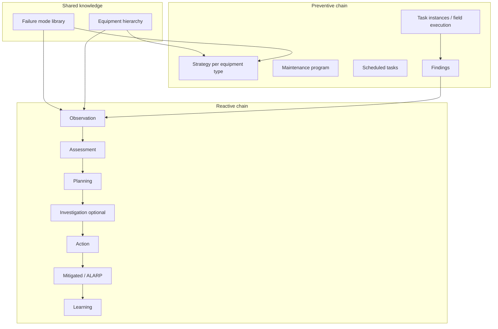
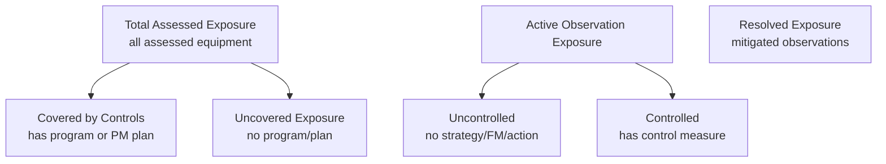
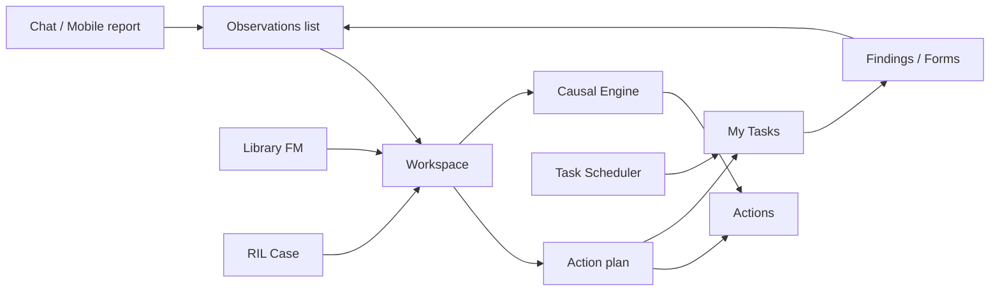

# AssetIQ Phase 2 — Product Reverse Engineering

**Version:** 1.0  
**Date:** June 2026  
**Scope:** Business system and reliability operating model (no technical architecture)  
**Method:** Reverse-engineered from product UI, domain services, and operating workflows in the live codebase

**Companion:** Phase 1 technical architecture is in `ASSETIQ_SYSTEM_ARCHITECTURE_AND_FUNCTIONAL_DESIGN.md`. This document answers *what AssetIQ is as a product*, *how reliability work flows*, and *what value each persona receives*.

---

## Document map

| # | Specification | Section |
|---|---------------|---------|
| 1 | Reliability Operating System | §1 |
| 2 | Reliability Knowledge Graph | §2 |
| 3 | Reliability Intelligence Layer | §3 |
| 4 | Executive Value Model | §4 |
| 5 | Digital Twin | §5 |
| 6 | AI Product | §6 |
| 7 | Competitive Positioning | §7 |
| 8 | Screen-by-Screen Functional Spec | §8 |
| 9 | Data Contract Specification | §9 |
| 10 | Rebuild Blueprint | §10 |

---

# §1 — Reliability Operating System Specification

## 1.1 Product definition

AssetIQ is a **Reliability Operating System (ROS)** for asset-intensive industry. It is not a CMMS with a dashboard bolted on. It is an operating model that connects:

- **Knowledge** — what can fail, on what equipment, and what to do about it (FMEA library)
- **Signals** — what is happening in the field (observations, forms, logs, telemetry)
- **Decisions** — how serious it is (multi-dimensional criticality + risk scoring)
- **Work** — who does what, by when (actions, PM, investigations)
- **Outcomes** — whether exposure was reduced (mitigation, learning, closed-loop metrics)

The ROS runs two parallel chains that converge on the same equipment and failure-mode knowledge:



## 1.2 Operating principles

| Principle | Product meaning |
|-----------|-----------------|
| **Observation is the unit of risk** | Field signals become scored, assignable work with monetary exposure |
| **Library before improvisation** | Failure modes and recommended actions are curated, versioned, and reusable |
| **Exposure is translatable** | Production criticality converts to downtime hours and currency for executives |
| **ALARP is measurable** | Mitigation progress is a % through defined journey stages, not a checkbox |
| **Work is unified** | My Tasks merges maintenance, actions, and ad-hoc plans into one execution queue |
| **Learning closes the loop** | Learning-type actions complete the journey at 100% ALARP progress |

## 1.3 Process Journey (reactive operating model)

The **Process Journey** is the canonical reactive lifecycle shown in the Observation Workspace. Stages and ALARP weighting:

| Stage | Business meaning | ALARP contribution |
|-------|------------------|-------------------|
| **Observation** | Issue reported with asset context | 10% (record exists) |
| **Assessment** | Failure mode linked, equipment confirmed, risk scored | +10% |
| **Planning** | At least one action in the plan | +10% |
| **Investigation** | Optional RCA case opened | 0% (parallel track) |
| **Action** | Corrective work in progress | Up to +40% (pro-rated by completion) |
| **Mitigated** | All plan actions complete — ALARP achieved | 90% |
| **Learning** | Learning action completed — knowledge captured | 100% |

**Terminal statuses** (removed from active exposure): mitigated, learning, closed, resolved, completed, done, dismissed, archived, cancelled.

**Auto-mitigation:** When all action-plan items reach complete status, the system can auto-advance observation to mitigated (`observation_mitigation`).

## 1.4 Preventive operating model

| Stage | Actor | Outcome |
|-------|-------|---------|
| Equipment type strategy | Reliability engineer | PM / CM / PDM task definitions per equipment type |
| Apply strategy | Planner / system | Programs instantiated on equipment |
| Schedule | Planner | `scheduled_tasks` with dates, technicians, disciplines |
| Execute | Technician | Task instances completed in My Tasks with evidence |
| Findings | Inspector | Form submissions or findings may spawn observations |

**Control definition (executive lens):** Equipment is "controlled" when it has an active v2 maintenance program, imported PM plan, equipment-type strategy, EFM with strategy tasks, or an observation with linked actions.

## 1.5 Personas and operating responsibilities

| Persona | Operating role | Primary ROS surfaces |
|---------|----------------|----------------------|
| **Operator** | Report defects, execute assigned work | Mobile, My Tasks, quick observation |
| **Maintenance technician** | Complete PM and corrective work | My Tasks, Actions, Forms |
| **Reliability engineer** | Own library, assess risk, run RCA | Library, Observation Workspace, Causal Engine |
| **Maintenance planner** | Build programs and schedules | Task Scheduler, Library strategies |
| **Supervisor** | Team workload and risk oversight | Supervisor Command Center, operational dashboard |
| **Executive** | Portfolio exposure and control coverage | Executive dashboard |
| **Administrator** | Configure risk model, users, readiness | Settings |

## 1.6 Work-signal canonical model

New observations are created through **`create_work_signal()`**: write to canonical `observations`, project mirror to legacy `threats` for UI compatibility. The product still labels the module "Observations" while API paths retain `/threats` heritage.

**Unified reads** deduplicate across both stores via `list_unified_signals()`.

## 1.7 Success metrics (operating system KPIs)

| Metric | Meaning |
|--------|---------|
| Assessment maturity | % of maintainable equipment with production criticality assessed |
| Control coverage | % of assessed exposure covered by programs/strategies |
| Uncontrolled active exposure | € at risk from active observations without controls |
| PM compliance | % scheduled PM completed in period |
| ALARP completion rate | Observations reaching mitigated/learning |
| Digital execution evidence | Form submissions + completed tasks (adoption proxy) |
| Case resolution time | RIL P1/P2 case closure (intelligence layer) |

---

# §2 — Reliability Knowledge Graph Specification

## 2.1 Product purpose

The Reliability Knowledge Graph is AssetIQ's **institutional memory of how reliability entities connect**. It enables:

- Traversal from any equipment to its strategies, work history, findings, observations, investigations, and actions
- AI copilot answers grounded in real relationships (not hallucinated context)
- Equipment reliability trace and profile views
- Digital twin fingerprints (edge counts and topology at a point in time)

It is an **edge-only graph in MongoDB** — nodes are implied by entity type + ID; attributes stay in source collections.

## 2.2 Entity types (nodes)

| Node type | Business object |
|-----------|-----------------|
| `equipment` | Asset in hierarchy |
| `strategy` | Equipment-type maintenance strategy |
| `program` | Maintenance program (v2) |
| `program_task` | Task definition within program |
| `scheduled_task` | Planner-scheduled work item |
| `task_instance` | Field execution record |
| `finding` | Inspection / round finding |
| `observation` | Canonical work signal |
| `threat` | Legacy observation projection |
| `investigation` | RCA case |
| `cause` | Causal diagram node |
| `action` | Corrective/preventive work |
| `outcome` | Post-action result |
| `failure_mode` | Library FMEA entry |

## 2.3 Relationship types (edges)

**Maintenance chain:**
Equipment → Strategy → Program → Program Task → Scheduled Task → Task Instance → Finding

**Reactive chain:**
Finding → Observation → Threat → Investigation → Cause → Action

**Outcome chain:**
Action → Outcome → Reliability Impact → Equipment

~29 active relation types. Edges are **event-sourced**: created on entity lifecycle hooks (create, complete, close). Retired edges keep `status: retired` for audit.

## 2.4 Product capabilities powered by the graph

| Capability | User experience |
|------------|-----------------|
| **Graph evidence panel** | Observation Workspace shows linked evidence chain |
| **Equipment reliability trace** | `/equipment/:id/trace` — timeline of graph traversals |
| **Reliability profile** | Composed single-asset health view |
| **Knowledge graph dialog** | Visual exploration from RIL dashboard |
| **Copilot citations** | RIL Copilot answers cite traversed edges |
| **Strategy outcome** | 90-day effectiveness of strategy-linked actions |
| **Ontology view** | Schema + live edge counts for admins |

## 2.5 Graph sync rules (product semantics)

| Event | Graph effect |
|-------|--------------|
| Observation created | Links equipment, failure mode, source finding if any |
| Investigation opened | Links observation, seeds cause nodes |
| Action created | Links observation or investigation |
| Task completed | Links equipment, may link finding |
| Action closed with outcome | Links outcome → reliability impact → equipment |

## 2.6 Data quality expectations

- Graph completeness improves as customers use full ROS (strategy → execution → observation loop)
- `reliability_edges_total` is an executive/RIL health indicator
- Missing edges = broken traceability = weaker AI copilot and twin fingerprints

---

# §3 — Reliability Intelligence Layer Specification

## 3.1 Product definition

**RIL (Reliability Intelligence Layer)** is an intelligence overlay on the core ROS. It does not replace observations, library, or scheduler — it adds telemetry, prediction, case management, and natural-language interrogation.

**Positioning:** Core ROS = *do reliability work*. RIL = *understand fleet patterns and prioritize attention*.

## 3.2 RIL product modules

| Module | User-facing name | Purpose |
|--------|------------------|---------|
| **RIL Dashboard** | Reliability Intelligence tab | Fleet score, exposure, cases, at-risk equipment |
| **RIL Cases** | Reliability Cases | P1–P4 case backlog with resolution workflow |
| **RIL Observations** | (API / integration) | Multi-source observation ingestion with risk scoring |
| **Readings** | Telemetry ingest | Sensor/SCADA threshold monitoring |
| **Alerts** | Intelligent alerts | Triage, priority, case linkage |
| **Correlations** | Pattern detection | Cross-signal correlation surfacing |
| **Predictions** | At-risk equipment | Health scores, predicted failure list |
| **Copilot** | Reliability Copilot | NL Q&A grounded in graph + twin + cases |
| **Twin** | Digital twin snapshots | Time-indexed equipment state (see §5) |

## 3.3 RIL Dashboard — what the user sees

| Widget / KPI | Business meaning |
|--------------|------------------|
| Reliability score | Heuristic fleet health (base 85 − penalties for P1 cases, alerts) |
| Risk exposure | Equipment with health score below threshold |
| Open cases | Active reliability cases by priority |
| Emerging risks | Recent correlations and alerts |
| Equipment at risk | Prediction engine output |
| Strategy coverage % | Equipment types with active strategies |
| PM overdue | Scheduled + instance overdue counts |
| MTBF proxy | 90-day mean days between failures (fleet) |
| Graph edge count | Knowledge graph connectivity indicator |

## 3.4 RIL Case operating model

| Field | Purpose |
|-------|---------|
| Case number | Traceable reliability incident container |
| Priority (P1–P4) | Escalation and executive attention |
| Status | Open → investigating → resolved |
| Linked observations | Evidence from field |
| Linked alerts | Telemetry triggers |
| Resolution summary | Closure narrative + root cause |
| Copilot | In-case NL assistant |

**Workflow:** Alert or observation pattern → case created → engineer investigates → links evidence → resolves with root cause → feeds learning loop.

## 3.5 RIL Copilot — product behavior

**Inputs:** Natural language query; optional equipment scope.

**Outputs:** Answer text, structured data, suggested actions, graph citations.

**Pre-built prompts:** "What needs attention today?", "What changed this week?", "Highest risk equipment?", P1 case drill-downs.

**Grounding sources:** Open cases, alerts, predictions, graph traversal, twin snapshot delta, observation backlog.

## 3.6 RIL vs Core ROS — boundary

| Question | Use Core ROS | Use RIL |
|----------|--------------|---------|
| Report a defect | ✓ Observation | |
| Plan corrective work | ✓ Action plan | |
| Manage FMEA library | ✓ Library | |
| Ingest sensor data | | ✓ Readings |
| Fleet-level pattern | | ✓ Correlations |
| Executive € exposure | ✓ Executive dashboard | |
| Fleet reliability score | | ✓ RIL executive |
| Ask "why is P-101 risky?" | Workspace trace | ✓ Copilot |

---

# §4 — Executive Value Model Specification

## 4.1 Executive question

> **"Where is my production money at risk, and is it under control?"**

AssetIQ translates reliability work into **currency**, **coverage**, and **evidence** — not just risk heatmaps.

## 4.2 Exposure model

### Production exposure (per equipment)

Deterministic translation from production criticality assessment (1–5):

| Level | Business scenario | Downtime hours used for € |
|-------|-------------------|---------------------------|
| 1 Minimal | No production impact / redundancy | 0 |
| 2 Low | Downtime under 8 hours | 8 |
| 3 Medium | 8–24 hours | 24 |
| 4 High | 24–72 hours | 72 |
| 5 Critical | Plant shutdown (>72 hours) | 72 (floor) |

```
Equipment exposure (€) = hours × hourly production cost
```

Default hourly cost: **€500/h** — configurable per user/installation.

### Portfolio exposure waterfall



| Layer | Executive interpretation |
|-------|-------------------------|
| **Total assessed** | Maximum theoretical downtime cost in portfolio |
| **Covered** | Exposure with maintenance strategy or program in place |
| **Uncovered** | Gap — assessed assets without preventive coverage |
| **Uncontrolled active** | Live issues without any control — highest urgency |
| **Controlled active** | Live issues with mitigation plan in motion |
| **Resolved** | Successfully mitigated — trend line for improvement |

## 4.3 Executive KPI cards

| KPI | Value type | Trend |
|-----|------------|-------|
| Total lifecycle exposure | € | Period over period |
| Control coverage | % | ↑ good |
| Uncovered exposure | € | ↓ good |
| Assessment maturity | % equipment assessed | ↑ good |
| Active threat exposure | € | ↓ good |
| Critical active exposure | € subset high/critical | ↓ good |
| Resolved exposure | € mitigated | ↑ good |
| PM compliance | % | ↑ good |
| Digital execution | forms + tasks count | ↑ good |

## 4.4 Evidence drill-down

Every KPI is **evidence-backed**. Executives paginate into:

- Equipment lists (uncovered exposure)
- Observation lists (active uncontrolled)
- Program coverage gaps

This is the product's answer to "show me the proof" — not vanity metrics.

## 4.5 AI executive narrative

Auto-generated summary paragraph synthesizes KPI movement in plain language. **Advisory only** — numbers come from deterministic calculations.

## 4.6 Two executive surfaces

| Surface | Question answered | Primary currency |
|---------|-------------------|------------------|
| **Executive Dashboard** (`/dashboard` executive tab) | Where is € at risk? Is it controlled? | Euro exposure |
| **RIL Executive** (`/reliability` tab) | How healthy is the reliability program? | Reliability score, cases, predictions |

Executives with `dashboard_executive` permission see the financial waterfall. Reliability leadership uses RIL for operational intelligence.

## 4.7 Value realization path

| Maturity stage | Executive sees |
|----------------|----------------|
| 1 — Assess | Assessment maturity rising; total exposure becomes visible |
| 2 — Cover | Control coverage % increases as strategies applied |
| 3 — Execute | PM compliance and digital execution grow |
| 4 — React | Uncontrolled active exposure shrinks; resolved exposure grows |
| 5 — Learn | Outcome summary shows risk reduction from completed actions |

---

# §5 — Digital Twin Specification

## 5.1 Product definition

AssetIQ's Digital Twin is **not** a 3D CAD model. It is a **time-indexed reliability state** of each equipment asset:

- Health score
- Open threat/observation count
- Overdue PM count
- Active failure modes
- Graph topology fingerprint (edge count, pattern)

## 5.2 Implemented capabilities

| Capability | Status | User value |
|------------|--------|------------|
| Daily reliability snapshot per equipment | **Live** | Point-in-time asset health card |
| Query snapshot at timestamp | **Live** | "What did this asset look like last Tuesday?" |
| Graph-at-time | **Live** | Relationships active at historical moment |
| Week-over-week delta | **Live** | Trend for copilot and profile views |
| Copilot twin context | **Live** | Answers reference state change |
| Reliability profile page | **Live** | `/equipment/:id/reliability` |

## 5.3 Health score model (current)

**Heuristic, not ML:**

```
health_score = 85 − (high_risk_threats × 5) − min(overdue_pm × 2, 20)
```

Transparent penalties — suitable for operations, not predictive maintenance claims.

## 5.4 Partial / roadmap

| Capability | Status |
|------------|--------|
| ML-driven RUL | Not implemented |
| Automated 3D/visual twin | Not in scope |
| Full time-travel UI | Backend ready; limited frontend |
| Telemetry fusion in snapshot | Partial via `ril_readings` summary |

## 5.5 Twin in the operating model

The twin connects **preventive state** (PM overdue), **reactive state** (open observations), and **knowledge state** (active FMs, graph edges) into one asset-level score consumable by RIL Copilot and equipment reliability profile.

---

# §6 — AI Product Specification

## 6.1 AI product philosophy

| Rule | Product implication |
|------|---------------------|
| **AI advises; code decides** | Risk scores, € exposure, RPN, ALARP % are deterministic |
| **User applies suggestions** | Library improve, consolidate, merge — preview then apply |
| **Grounded when possible** | Copilot and workspace AI use graph evidence packs |
| **Cost visible** | AI Usage settings for admins |
| **Graceful degradation** | Lexical fallbacks when AI unavailable (e.g. duplicate scan) |

## 6.2 AI product modules

### Field intake

| Feature | User benefit | Mode |
|---------|--------------|------|
| **Report Observation Chat** | Conversational defect reporting with equipment/FM matching | Semi-autonomous — confirms before create |
| **Voice transcription** | Hands-free reporting | Input assist |
| **Improve Description** | Polish operator text in workspace | Advisory — apply |
| **Photo AI analysis** | Damage/safety findings from images | Advisory display |

### Observation intelligence

| Feature | User benefit | Mode |
|---------|--------------|------|
| **AI Risk Analysis** | Dynamic risk narrative, forecasts, insights | Advisory |
| **Generate causes** | Probable cause suggestions | Advisory |
| **Fault tree / Bow-tie** | Visual risk models | Advisory |
| **Optimize actions** | Prioritized action suggestions | Advisory |
| **Explain threat** | Natural-language "why" | Advisory |

### Library intelligence (`library_ai_tools` permission)

| Feature | User benefit | Mode |
|---------|--------------|------|
| Suggest failure modes | Map library to equipment types | Advisory — accept links |
| Suggest new failure modes | Propose new FMs | Advisory — bulk create |
| Improve with AI | ISO 14224-quality FM refinement | Advisory — apply |
| Consolidate actions | Merge redundant recommended actions | Advisory — apply optional |
| Review action disciplines | Re-tag PM/CM/PDM disciplines | Advisory — per-row apply |
| Find similar FMs | Deduplicate library | Advisory — merge |
| Find duplicate actions | Cross-action dedupe within FMs | Advisory — merge |
| Suggest equipment types | Gap analysis vs hierarchy | Advisory |
| AI map equipment types | Type assignment for untagged nodes | Advisory — bulk accept |

### Planning & execution

| Feature | User benefit | Mode |
|---------|--------------|------|
| **PM Import AI enrich** | Translate, type, discipline on import | Autonomous on upload — user reviews |
| **PM Import AI review** | Map tasks to failure modes | Advisory — apply per task |
| **AI Maintenance Planner** | Technician assignment + dates | Semi-autonomous — select & apply |
| **Form vision extract** | Photo → structured form fields | Semi-autonomous — user edits |

### Investigation & executive

| Feature | User benefit | Mode |
|---------|--------------|------|
| **Defensive reasoning check** | Flags blame/solution-jumping in problem statements | Advisory |
| **AI executive summary** | NL paragraph on dashboard | Advisory |
| **AI dashboard builder** | NL → widget intent | Advisory |
| **Translation generator** | Bulk NL/DE translations | Background |

### RIL

| Feature | User benefit | Mode |
|---------|--------------|------|
| **Reliability Copilot** | NL Q&A on fleet/case/equipment | Advisory — citations |

## 6.3 AI permission model

- **`library_ai_tools`** — gates all Library AI menu items
- **`chat`** — global chat sidebar
- **Owner/admin** — AI Usage monitoring and limits

## 6.4 What AI must never own

- Final risk score (0–100) and risk level labels
- Executive € exposure totals
- FMEA RPN used in scoring (`min(100, rpn/10)`)
- ALARP progress percentage
- Permission decisions

---

# §7 — Competitive Positioning Analysis

## 7.1 Category definition

AssetIQ competes in **Industrial Reliability Intelligence** — the intersection of:

- EAM/CMMS (work execution)
- FMEA/risk registers (engineering knowledge)
- Operational risk management (ALARP, exposure)
- APM/predictive (RIL telemetry — emerging)

It is **not** positioned as a generic enterprise asset management replacement or a pure IoT platform.

## 7.2 Differentiation matrix

| Dimension | Generic CMMS | AssetIQ |
|-----------|--------------|---------|
| Failure knowledge | Ad-hoc work order text | Versioned FMEA library with recommended actions |
| Risk model | Priority field | Criticality × FMEA blend + multi-dimensional exposure |
| Executive view | Work order backlog counts | € exposure waterfall with control coverage |
| Field intake | Form-only | Chat + voice + photo AI + mobile offline |
| Root cause | Optional ticket notes | Causal Engine with 5-Why, cause tree, evidence |
| Traceability | Ticket links | Reliability knowledge graph traversal |
| AI | Chatbot add-on | Grounded copilot + library tooling; deterministic scores |
| Standards | Vendor-specific | ISO 14224 hierarchy and FM taxonomy alignment |
| Closed loop | Open/close work order | Observation → Action → Mitigated → Learning → Outcome |

## 7.3 Target customer profile

| Attribute | Fit |
|-----------|-----|
| Industry | Process, mining, utilities, heavy manufacturing |
| Asset complexity | High — rotating, pressure, instrumentation |
| Pain | Unplanned downtime cost visible; FM knowledge in spreadsheets |
| Maturity | Moving from reactive firefighting to reliability program |
| Geography | EU operations (NL/DE/EN i18n built-in) |
| Buyer | Reliability director + operations + IT |

## 7.4 Competitive threats

| Competitor type | AssetIQ vulnerability | AssetIQ defense |
|-----------------|----------------------|-----------------|
| Enterprise CMMS (Maximo, SAP PM) | Deep ERP integration, mature workflows | Faster time-to-value, reliability-native UX, AI library tools |
| APM (SKF, Augury) | Sensor-native prediction | Broader ROS — knowledge + work + exposure, not just vibration |
| EHS platforms | Safety case management | Multi-dimensional exposure includes safety; ALARP journey |
| Spreadsheets + SharePoint | Free, flexible | Graph, scoring, executive € model, mobile execution |

## 7.5 Win themes (sales language)

1. **"See your downtime in euros, not colors."**
2. **"Your failure modes become executable work, not PDFs."**
3. **"One workspace from observation to ALARP."**
4. **"AI that knows your equipment graph, not the internet."**
5. **"Prove control coverage to your board."**

## 7.6 Product gaps vs category leaders (honest)

| Gap | Impact |
|-----|--------|
| ERP/finance integration | No native SAP cost center sync |
| Full predictive ML | RIL health score is heuristic |
| Mature mobile offline | Present but not best-in-class vs field-service apps |
| Multi-site enterprise RBAC | Tenant wave still rolling |
| 3D/digital twin visualization | Backend snapshots only |

---

# §8 — Complete Screen-by-Screen Functional Specification

## 8.1 Navigation map

**Primary nav:** Dashboard · Observations · Causal Engine · Actions · My Tasks · Task Scheduler · Form Submissions · Library

**Settings gear:** Definitions, Equipment Manager, User Management, Preferences, Risk Calculation, Server Performance, Database, AI Usage, Maintenance Readiness, Audit Log, Statistics, and compliance sub-pages.

**Role behaviors:**
- Operators on mobile → Operator Landing (shortcuts to tasks, observations)
- Reliability engineers on desktop → auto-redirect to Library Intelligence Map
- Feature gates hide nav items per permission matrix

## 8.2 Authentication screens

| Screen | Actions | Creates |
|--------|---------|---------|
| Login | Email/password or OIDC | Session |
| Register | Self-registration | Pending user |
| Forgot / Reset password | Email reset flow | Updated credentials |
| OIDC callback | SSO completion | Session |
| First login flow | Password change, terms | Compliant user record |

## 8.3 Dashboard (`/dashboard`)

| Tab | Permission | Content | Actions |
|-----|------------|---------|---------|
| Operational | `dashboard_operational` | KPI cards, top-10 risk observations, distributions, recent activity | Drill to lists; filter by discipline/owner/plant |
| Builder | `dashboard_builder` | Smart dashboard composer | Save custom layouts |
| Production | `dashboard_production` | Production KPIs | View metrics |
| Reliability | `reliability_intelligence` | Embedded RIL dashboard | Open cases, copilot, graph |
| Executive | `dashboard_executive` | € exposure waterfall, KPI cards, AI summary | Evidence drill-down |

## 8.4 Observations

### List (`/threats`)

| Element | Behavior |
|---------|----------|
| Filters | Status, risk, asset, discipline, owner |
| Sort | Risk score, date, rank |
| Row actions | Open workspace, delete (if permitted) |
| Stats bar | Open count, critical count |

### Workspace (`/threats/:id/workspace`)

**Hero:** Risk badge, threat number, title (equipment + FM), graph evidence panel

**Exposure row:** Production €, Safety, Environmental, Reputation, ALARP %, risk summary

**Details section:** Edit description, status, equipment, FM, attachments, discipline, share, delete, improve description (AI)

**Timeline:** Equipment reliability events + AI evidence

**Three-column work area:**
- Reliability Intelligence (FM context, history)
- Recommended Actions (from library + AI)
- Action Plan (assigned work)

**Process Journey:** Visual stage tracker

**Dialogs:** Full AI analysis, graph evidence, add recommendations to plan

**Creates/updates:** Actions, observation fields, AI analysis cache

## 8.5 Library (`/library`)

| Tab | Actions | Creates/updates |
|-----|---------|-----------------|
| Intelligence Map | Explore FM/equipment graph | — |
| Failure Modes | CRUD, validate, version history, export, AI tools | FM records |
| Equipment Types | CRUD types, link FMs, AI suggest | Types, links |
| Maintenance | Edit strategies per type | Strategy records |
| Schedule | Manage maintenance schedules | Schedule data |
| PM Import | Import wizard | Imported PM data |

**AI toolbar (gated):** Suggest FMs, new FMs, improve, consolidate, find similar, duplicate actions, new equipment types

## 8.6 Causal Engine (`/causal-engine`) — desktop only

| Tab | Content | Actions |
|-----|---------|---------|
| Overview | Metadata, evidence upload, AI summary, PDF export, status | Create/complete investigation |
| Timeline | Chronological events | CRUD events |
| Failures | Failure identifications | CRUD failures |
| Causes | Causal tree | CRUD causes, mark root cause |
| Actions | Investigation + central actions | Promote to central plan, validate |

## 8.7 Actions

| Screen | Actions |
|--------|---------|
| List (`/actions`) | Filter, quick status, edit, delete |
| Detail (`/actions/:id`) | Full edit, closure workflow, lineage to observation |

## 8.8 My Tasks (`/my-tasks`)

| Tab | Content | Actions |
|-----|---------|---------|
| Open | Date-scoped work items | Start, complete with evidence/photos |
| Overdue | Past-due items | Complete, delete |
| Recurring | Recurring PM | Execute |
| Adhoc | Ad-hoc plans | Execute plan, reorder |

**Offline:** Queue completions, sync banner

## 8.9 Task Scheduler (`/tasks`) — desktop

Tabs: Task instances, templates, forms. Calendar/list views. Template and plan CRUD.

## 8.10 Equipment Manager (`/equipment-manager`) — desktop

Tree panel with drag-drop hierarchy. Properties: type, criticality, disciplines. Import (text, Excel, process diagram). AI type mapping. Maintenance program view per node.

## 8.11 RIL

| Screen | Content | Actions |
|--------|---------|---------|
| RIL Dashboard tab | Score, cases, at-risk, copilot, graph | Navigate, ask copilot |
| Cases list | Filter, search | Create case |
| Case detail | Observations, alerts, history tabs, resolution | Edit, resolve, copilot |

## 8.12 Equipment reliability

| Screen | Purpose |
|--------|---------|
| `/equipment/:id/trace` | Graph-based reliability trace |
| `/equipment/:id/reliability` | Reliability profile / twin snapshot |

## 8.13 Mobile (`/mobile`)

Tabs: Home (hierarchy), Analytics, Tasks, Alerts. Permission-gated. Offline-capable task completion.

## 8.14 Settings (representative)

| Screen | Purpose |
|--------|---------|
| Risk Calculation | Per-installation 75/25 weights and thresholds |
| Permissions | Role × feature matrix |
| User Management | Users, roles, installations |
| AI Usage | Token/cost monitoring |
| Maintenance Readiness | Program readiness checks |
| Audit Log | Security audit trail |
| GDPR pages | Deletion requests, consent |

## 8.15 Stub / placeholder

| Screen | Status |
|--------|--------|
| `/decision-engine` | Under development placeholder |

## 8.16 Cross-screen product flows



---

# §9 — Data Contract Specification

Business-level contracts for core entities. Field names match API payloads.

## 9.1 Observation (work signal)

| Field | Type | Required | Business rule |
|-------|------|----------|---------------|
| `id` | string | ✓ | UUID |
| `title` | string | ✓ | Display headline |
| `description` | string | | Free text; AI-improvable |
| `status` | enum | ✓ | Drives process journey |
| `linked_equipment_id` | string | | Links to hierarchy |
| `equipment_tag` | string | | Human tag e.g. P-101 |
| `failure_mode_id` | string | | Library link |
| `failure_mode` | string | | Denormalized name |
| `risk_score` | int 0–100 | | Deterministic blend |
| `risk_level` | enum | | Critical/High/Medium/Low |
| `criticality_score` | int | | From 4-dimension assessment |
| `fmea_score` | int | | From RPN/10 |
| `fmea_rpn` | int | | From linked FM |
| `discipline` | string | | Mechanical, rotating, etc. |
| `owner_id` | string | | Accountability |
| `recommended_actions` | array | | Strings or structured |
| `attachments` | array | | Media refs |
| `image_analysis` | object | | AI photo findings |

**Workspace composite** adds: `exposure`, `timeline`, `reliability_intelligence`, `action_plan`, `process_journey`, `investigation`.

## 9.2 Failure Mode

| Field | Type | Required | Business rule |
|-------|------|----------|---------------|
| `id` | string | ✓ | |
| `failure_mode` | string | ✓ | Name |
| `category` | string | ✓ | FMEA category |
| `equipment` | string | | Legacy equipment class |
| `equipment_type_ids` | string[] | | Applicability |
| `severity` | int 1–10 | ✓ | FMEA |
| `occurrence` | int 1–10 | ✓ | FMEA |
| `detectability` | int 1–10 | ✓ | FMEA |
| `rpn` | int | ✓ | severity × occurrence × detectability |
| `recommended_actions` | array | | `{description, action_type, discipline}` |
| `potential_effects` | array | | ISO enrichment |
| `potential_causes` | array | | ISO enrichment |
| `is_validated` | bool | | Library quality gate |

## 9.3 Action (central)

| Field | Type | Required | Business rule |
|-------|------|----------|---------------|
| `id` | string | ✓ | |
| `title` | string | ✓ | |
| `description` | string | | |
| `action_type` | enum | | preventive/corrective/predictive/operational |
| `status` | enum | ✓ | Drives completion |
| `priority` | enum | | |
| `source_type` | string | | threat/investigation/manual |
| `observation_id` | string | | Lineage |
| `linked_equipment_id` | string | | |
| `assignee` | string | | |
| `due_date` | date | | |
| `discipline` | string | | |
| `recommendation_id` | string | | Links to workspace recommendation |

## 9.4 Investigation

| Field | Type | Required | Business rule |
|-------|------|----------|---------------|
| `id` | string | ✓ | |
| `case_number` | string | ✓ | Display ID |
| `title` | string | ✓ | |
| `description` | string | | AI problem-check target |
| `status` | enum | ✓ | Locks edits when complete |
| `threat_id` | string | | Source observation |
| `asset_id` | string | | Equipment |
| `investigation_leader` | string | | |
| `incident_date` | datetime | | |

**Child entities:** `timeline_events`, `failure_identifications`, `cause_nodes`, `action_items`, `evidence`.

## 9.5 Equipment node

| Field | Type | Required | Business rule |
|-------|------|----------|---------------|
| `id` | string | ✓ | |
| `name` | string | ✓ | |
| `tag` | string | | P-101 etc. |
| `level` | enum | ✓ | ISO 14224 level |
| `parent_id` | string | | Hierarchy |
| `equipment_type_id` | string | | Triggers EFM generation |
| `criticality` | object | | 4 dimensions 1–5 + production_impact |
| `discipline` | string | | |

## 9.6 Work Item (My Tasks)

| Field | Type | Business rule |
|-------|------|---------------|
| `id` | string | May be prefixed `sched:` for legacy bridge |
| `title` | string | |
| `status` | enum | pending/overdue/planned/… |
| `source_type` | string | maintenance/action/task |
| `equipment_id` | string | |
| `due_date` | date | |
| `discipline` | string | |
| `ai_scheduled` | bool | Set if AI planner applied |

## 9.7 Executive dashboard response

| Field | Business meaning |
|-------|------------------|
| `exposure_metrics.total_lifecycle_exposure` | Portfolio € ceiling |
| `exposure_metrics.covered_by_controls` | € with programs |
| `exposure_metrics.uncovered_exposure` | € gap |
| `exposure_metrics.active_threat_exposure` | € live risk |
| `exposure_metrics.resolved_exposure` | € mitigated |
| `kpi_cards` | Named KPIs with trend arrows |
| `waterfall_data` | Chart series |
| `ai_summary` | NL narrative |
| `evidence_drill_down` | Paginated proof lists |

## 9.8 RIL Case

| Field | Business rule |
|-------|---------------|
| `case_number` | Traceable ID |
| `priority` | P1–P4 |
| `status` | open/investigating/resolved |
| `title`, `description` | |
| `linked_observation_ids` | Evidence |
| `linked_alert_ids` | Telemetry |
| `resolution_summary` | Required on close |
| `root_cause` | Required on close |

## 9.9 Contract invariants

1. **Risk score** on observation must be reproducible from criticality + FMEA + installation weights.
2. **Action** created from workspace must carry `observation_id` or `recommendation_id`.
3. **FM RPN** must equal severity × occurrence × detectability on publish.
4. **Equipment** child level must be valid per ISO 14224 parent-child rules.
5. **Executive exposure** must use same hourly cost source as observation workspace for consistency.

---

# §10 — Rebuild Blueprint

*Recreate AssetIQ as a product from zero source code.*

## 10.1 Product thesis

Build a **Reliability Operating System** that:
1. Captures field signals with minimal friction
2. Scores them against equipment criticality and failure-mode knowledge
3. Converts exposure to currency for executives
4. Drives corrective and preventive work to completion
5. Proves control coverage and learning over time

## 10.2 Build phases

### Phase A — Foundation (months 1–3)

| Deliverable | Acceptance criteria |
|-------------|---------------------|
| Equipment hierarchy | ISO 14224 levels, parent-child validation, types |
| Criticality assessment | 4 dimensions + production impact 1–5 |
| User/RBAC | 6 roles, feature permissions |
| Failure mode library | CRUD, RPN, recommended actions, validation flag |

### Phase B — Reactive loop (months 3–5)

| Deliverable | Acceptance criteria |
|-------------|---------------------|
| Observation create/list | Status, equipment, FM link |
| Risk scoring | 75/25 blend, configurable thresholds |
| Multi-dimensional exposure | Production €, safety, env, reputation |
| Action plan | Create actions from observation |
| Process journey + ALARP % | Stage-weighted progress |
| My Tasks inbox | Unified work items |

### Phase C — Knowledge & graph (months 5–7)

| Deliverable | Acceptance criteria |
|-------------|---------------------|
| Equipment-FM links (EFM) | Auto-generate on equipment create |
| Reliability edges | Event-synced graph on entity lifecycle |
| Equipment trace | Traverse graph from equipment |
| Strategy per equipment type | PM/CM/PDM task definitions |

### Phase D — Preventive loop (months 7–9)

| Deliverable | Acceptance criteria |
|-------------|---------------------|
| Maintenance programs v2 | Apply strategy to equipment |
| Scheduler | Templates, plans, instances |
| Form designer + submissions | Field data capture |
| PM compliance KPI | % completed in period |

### Phase E — Intelligence (months 9–12)

| Deliverable | Acceptance criteria |
|-------------|---------------------|
| Causal Engine | Investigation, timeline, causes, actions |
| Executive dashboard | € waterfall, evidence drill-down |
| AI gateway | Cost guard, advisory features only |
| Library AI tools | Suggest, improve, consolidate |
| Chat observation intake | Confirm-before-create |

### Phase F — RIL overlay (months 12–15)

| Deliverable | Acceptance criteria |
|-------------|---------------------|
| RIL cases | P1–P4 workflow |
| Readings + alerts | Ingest + triage |
| Predictions | At-risk equipment list |
| Copilot | Grounded NL with citations |
| Digital twin snapshots | Daily materialization, graph-at-time |

## 10.3 Entity build order

```
1. users, permissions, installations
2. equipment_types, equipment_nodes
3. failure_modes, equipment_failure_modes
4. observations (+ threat projection if legacy compat needed)
5. central_actions
6. investigations + child entities
7. equipment_type_strategies
8. maintenance_programs_v2, scheduled_tasks, task_instances
9. form_templates, form_submissions
10. reliability_edges (from day 1 of entity events)
11. work_item_projections (materialized inbox)
12. executive_kpi_snapshots
13. ril_* collections
14. reliability_snapshots (twin)
```

## 10.4 Formula registry (must implement identically)

```
criticality = min(100, round((safety×25 + production×20 + environmental×15 + reputation×10) / 3.5))
fmea_score = min(100, int(rpn / 10))
risk_score = min(100, int(criticality × Wc + fmea_score × Wf))  # default Wc=0.75, Wf=0.25
rpn = severity × occurrence × detectability
production_exposure_€ = downtime_hours(production_impact) × hourly_cost
health_score = 85 − high_risk_threats×5 − min(overdue_pm×2, 20)
```

## 10.5 Screen build order (MVP → full)

1. Login + permissions
2. Equipment Manager + Definitions
3. Library (FM tab only)
4. Observations list + Workspace (minimal)
5. Actions list + detail
6. My Tasks
7. Dashboard operational tab
8. Task Scheduler
9. Causal Engine
10. Library full tabs + AI tools
11. Executive dashboard
12. RIL dashboard + cases
13. Mobile shell
14. Settings suite

## 10.6 AI build order

1. Central gateway + cost guard + usage logging
2. Improve description (smallest vertical slice)
3. Library suggest/improve FMs
4. Chat observation intake
5. Workspace risk narrative (advisory)
6. PM import enrich
7. Copilot with graph context
8. Planner, consolidate, duplicate detection

## 10.7 Data migration assumptions

If rebuilding for an existing customer:

| Legacy source | Target entity |
|---------------|---------------|
| Spreadsheet FM library | failure_modes + recommended_actions |
| CMMS work orders | central_actions (one-time import) |
| Asset register | equipment_nodes + types |
| Open issues | observations with status mapping |

## 10.8 Go-live criteria

| Criterion | Measure |
|-----------|---------|
| Assess | >80% critical equipment has criticality |
| Cover | >60% assessed exposure has strategy or program |
| Execute | PM compliance tracked for 1 quarter |
| React | Observation → action → mitigated loop demonstrated |
| Prove | Executive dashboard shows € waterfall with evidence |
| Learn | ≥1 learning action completed per major incident |

## 10.9 Team composition (recommended)

| Role | Count | Owns |
|------|-------|------|
| Product / reliability SME | 1 | ROS model, FM taxonomy, acceptance |
| Full-stack lead | 1 | Scoring, workspace, graph |
| Frontend | 2 | Dashboard, mobile, library |
| Backend | 2 | API, graph sync, RIL |
| AI engineer | 1 | Gateway, copilot, library tools |
| QA / reliability tester | 1 | Journey tests, formula verification |

## 10.10 What not to rebuild first

- Decision engine (stub only in current product)
- Full ML predictive maintenance (heuristic health score sufficient for v1)
- 3D twin visualization
- Legacy maintenance v1 programs (start with v2 only)
- Dual actions collection (use central_actions only)

---

## Appendix — Glossary

| Term | Definition |
|------|------------|
| **ROS** | Reliability Operating System — AssetIQ product model |
| **ALARP** | As Low As Reasonably Practicable — mitigation journey target |
| **EFM** | Equipment Failure Mode — per-asset FM instance |
| **RIL** | Reliability Intelligence Layer |
| **FM** | Failure Mode (library entry) |
| **PM/CM/PDM** | Preventive / Corrective / Predictive maintenance |
| **Work signal** | Canonical observation record |
| **Control** | Strategy, program, or action plan covering exposure |

---

*End of Phase 2 Product Reverse Engineering Document*
