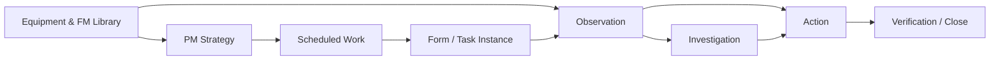
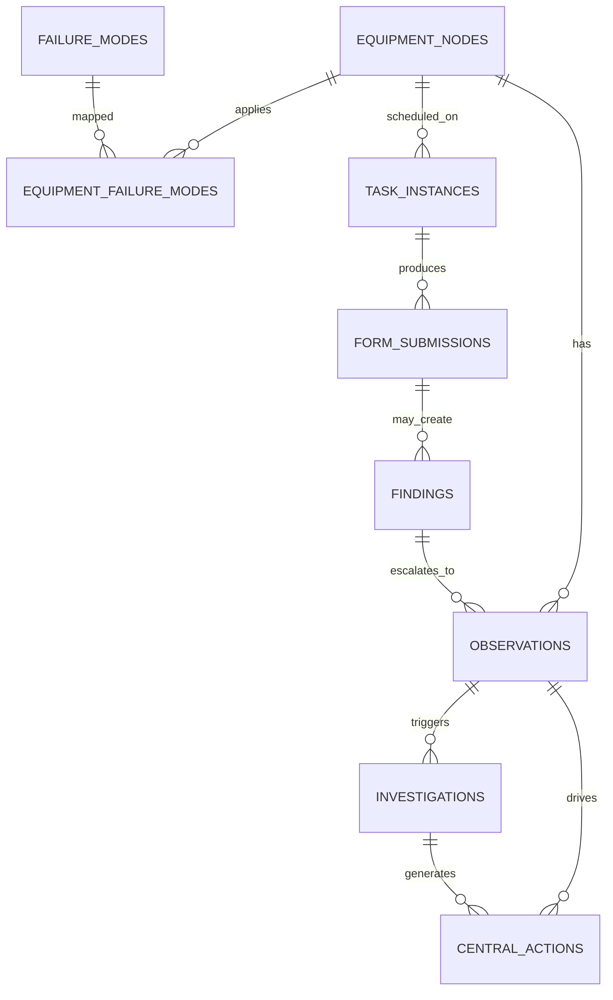
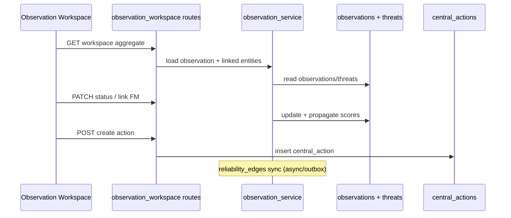
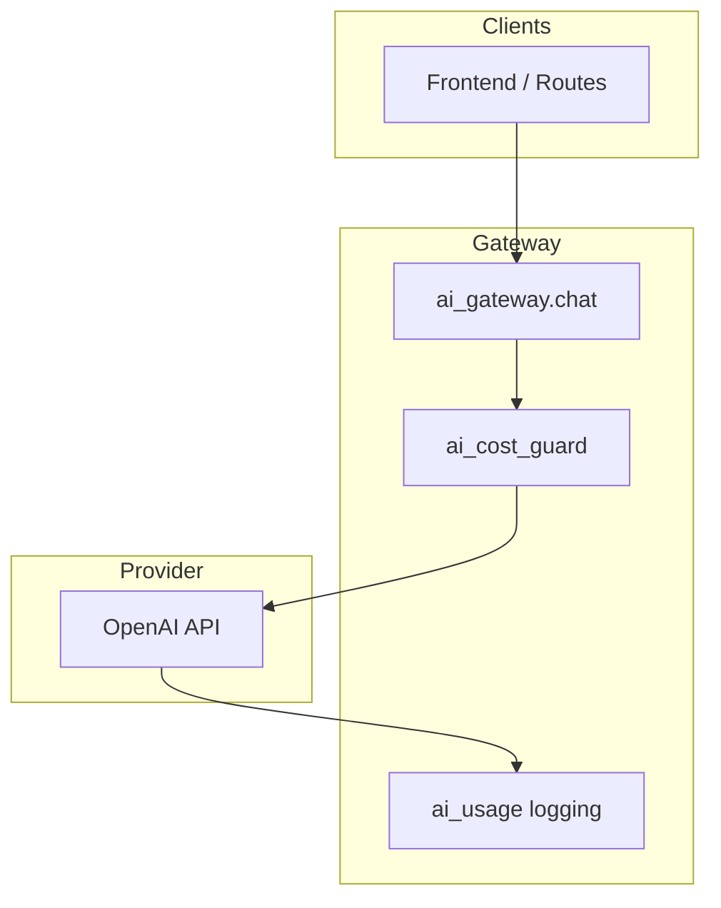
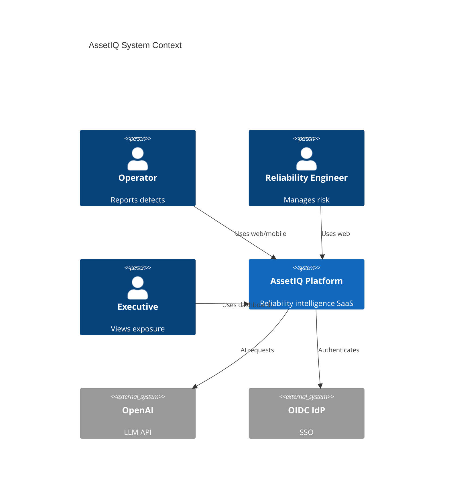
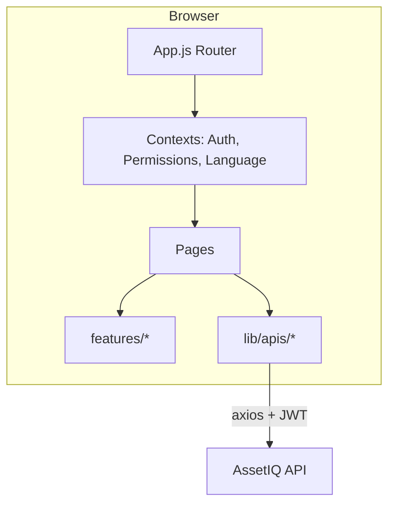
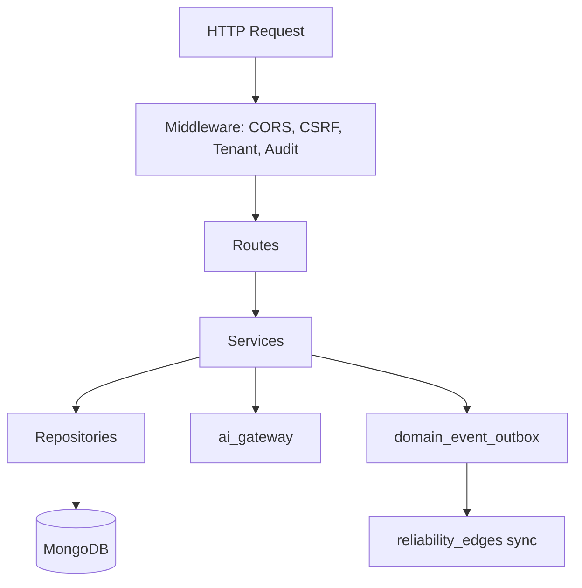
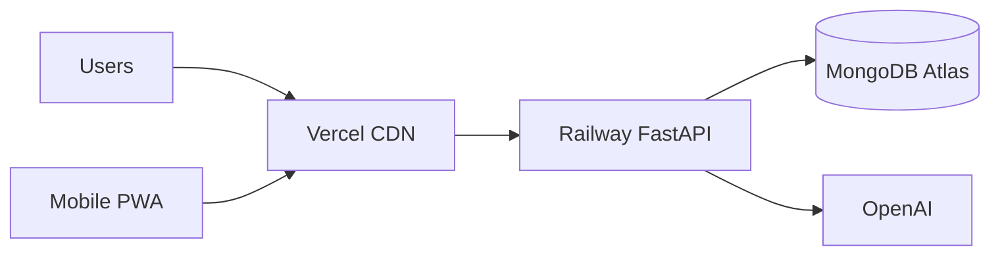
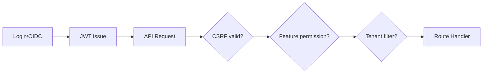

# AssetIQ System Architecture & Functional Design Document

**Version:** 1.0 (reverse-engineered from source)  
**Date:** June 2026  
**Scope:** Sections 1–16 per System Discovery brief  
**Method:** Code-traced documentation — no assumptions where source was unavailable are marked **UNCERTAIN**.

---

## SECTION 1 – Executive Summary

### Purpose

AssetIQ is an industrial **reliability intelligence platform** that connects equipment hierarchy, failure-mode knowledge (FMEA), field observations, investigations, corrective actions, and maintenance execution into a single operational system. It is designed for asset-intensive industries (processing, mining, utilities, manufacturing) where downtime cost, safety risk, and maintenance effectiveness must be managed together.

### Core business value

| Value | How AssetIQ delivers it |
|-------|-------------------------|
| Risk visibility | Blends equipment criticality with FMEA scores into a 0–100 risk model; monetary exposure from production criticality |
| Closed-loop reliability | Observations → investigations → actions → verification → closure |
| Knowledge reuse | ISO 14224–aligned equipment types and a curated failure-mode library with recommended actions |
| Maintenance optimization | PM strategies (v1/v2), scheduler, forms, and work execution KPIs |
| Executive decision support | Executive dashboard with lifecycle exposure, active threat exposure, and trend snapshots |
| AI augmentation | Advisory AI via centralized gateway — description improvement, FM suggestions, duplicate detection, investigations — **not** authoritative for numeric risk |

### Primary user groups

- **Executives** — exposure dashboards, cost avoidance narratives  
- **Reliability engineers** — failure modes, observations, investigations, RIL  
- **Maintenance planners / supervisors** — scheduler, My Tasks, command center  
- **Operators / inspectors** — mobile observations, forms, QR scans  
- **Administrators** — users, permissions, risk settings, audit, GDPR  

### Key differentiators

1. **Reliability knowledge graph** — `reliability_edges` materializes cross-domain relationships (equipment → strategy → work → findings → observations → actions). See `docs/RELIABILITY_KNOWLEDGE_GRAPH_DOCUMENTATION.md`.
2. **Deterministic risk scoring** — configurable 75/25 criticality/FMEA blend (`backend/services/threat_score_service.py`, `backend/models/risk_settings.py`).
3. **Observation workspace** — single canonical UI at `/threats/:id/workspace` (`frontend/src/App.js`).
4. **Feature-gated RBAC** — permissions matrix per role (`backend/services/permissions_defaults.py`).
5. **Architecture convergence program** — Wave 3 registry classifies routes GREEN/YELLOW/RED (`backend/architecture/convergence_registry.py`).

### Main workflows



**Sources:** `docs/data_model_relationships.md`, `frontend/src/App.js`, `backend/routes/observations.py`, `backend/routes/threats.py`.

---

## SECTION 2 – Product Vision

### Reliability objectives

- Standardize failure-mode taxonomy and recommended actions per equipment type.
- Link field signals (observations, readings, findings) to library knowledge.
- Support ALARP-style mitigation stages in observation workspace (`backend/services/observation_mitigation.py`).

### Asset management objectives

- Hierarchical equipment registry (`equipment_nodes`) with criticality assessment.
- Equipment-type strategies and failure-mode applicability (`equipment_failure_modes`, `equipment_type_strategies`).
- Asset history and file attachments per node.

### Maintenance objectives

- Program-based PM (legacy `maintenance_programs` and v2 `maintenance_programs_v2`).
- Task scheduling, technician assignment, timeline views (`backend/routes/maintenance_scheduler/`).
- Work item projections for unified task/action inbox (`work_item_projections`).

### Inspection objectives

- Dynamic form designer and mobile execution (`form_templates`, `form_submissions`).
- Production log ingestion and parsing (`production_logs`, AI parse endpoint).
- QR-based equipment lookup (`backend/routes/qr_codes.py`).

### Operational objectives

- Real-time observation intake from operations and mobile.
- Supervisor command center for team workload visibility.
- Production dashboard for machine-level KPIs.

### How AssetIQ improves outcomes

| Outcome | Mechanism |
|---------|-----------|
| Reliability | FM library + investigation root-cause + action tracking |
| Availability | Exposure metrics tie risk to downtime hours × hourly cost |
| Risk reduction | Ranked observations, mitigation workflow, executive active exposure |
| Lifecycle cost | Covered vs uncovered assessed exposure on executive dashboard |
| Digital transformation | Forms, mobile, AI assist, knowledge graph traversal |

---

## SECTION 3 – User Personas

Six system roles are defined in `backend/services/permissions_defaults.py`: **owner**, **admin**, **reliability_engineer**, **maintenance**, **operations**, **viewer**. Custom roles inherit from a base role via `backend/routes/permissions.py`.

### Executive

| Aspect | Detail |
|--------|--------|
| Responsibilities | Portfolio risk, exposure trends, investment prioritization |
| Screens | Executive dashboard (`/dashboard` executive mode), production dashboard |
| Permissions | `dashboard_executive` (owner only by default) |
| Workflows | Review lifecycle exposure, active threat exposure, resolved exposure |
| Data consumed | `executive_dashboard_service`, materialized snapshots |
| Data generated | Comments, strategic actions (via delegation) |

### Reliability Engineer

| Aspect | Detail |
|--------|--------|
| Responsibilities | FM curation, observation triage, investigations, RIL cases |
| Screens | `/library`, `/threats`, `/threats/:id/workspace`, `/causal-engine`, `/reliability` |
| Permissions | `library`, `library_ai_tools` (limited), `investigations`, `reliability_intelligence` |
| Workflows | Link FM, assess risk, run 5-Why / causal engine, consolidate actions |
| Data consumed | `failure_modes`, `observations`, `investigations`, RIL APIs |
| Data generated | FM versions, investigation records, reliability edges |

### Maintenance Planner

| Aspect | Detail |
|--------|--------|
| Responsibilities | PM programs, scheduling, work assignment |
| Screens | `/tasks`, `/my-tasks`, `/library` (read), equipment manager |
| Permissions | `scheduler`, `tasks`, `actions` |
| Workflows | Build programs, schedule tasks, complete work items |
| Data consumed | `maintenance_programs_v2`, `scheduled_tasks`, `task_instances` |
| Data generated | Task instances, form submissions, completion outcomes |

### Inspector / Field Technician

| Aspect | Detail |
|--------|--------|
| Responsibilities | Rounds, inspections, defect reporting |
| Screens | `/mobile/*`, `/forms`, `/qr-scan`, mobile observation create |
| Permissions | `observations` write, `forms` read (role-dependent) |
| Workflows | Offline-capable mobile capture → sync queue |
| Data consumed | Equipment QR, form templates |
| Data generated | Observations, form submissions, photos |

### Operations

| Aspect | Detail |
|--------|--------|
| Responsibilities | Report defects, execute assigned actions |
| Screens | `/threats`, `/actions`, `/my-tasks`, supervisor (read) |
| Permissions | `observations` write, `actions` write, no settings |
| Workflows | Quick observation → action assignment |
| Data consumed | Equipment context, action inbox |
| Data generated | Observations, action status updates |

### Administrator

| Aspect | Detail |
|--------|--------|
| Responsibilities | Users, permissions, risk formulas, audit, GDPR |
| Screens | `/settings/*` |
| Permissions | `users`, `settings` (owner/admin) |
| Workflows | Role matrix, risk thresholds, database context (owner) |
| Data consumed | `users`, `permissions`, `audit_log`, `risk_settings` |
| Data generated | Configuration changes, audit entries |

---

## SECTION 4 – Complete Feature Inventory

Features grouped by module. **Implemented** = routable UI + backend handler present. **Partial** = UI stub, legacy path, or migration in progress.

### Asset / Equipment Management

| Feature | Status | Key paths |
|---------|--------|-----------|
| Equipment hierarchy (nodes) | Implemented | `routes/equipment/equipment_nodes.py` |
| Equipment types (ISO 14224) | Implemented | `routes/equipment/equipment_types.py` |
| Criticality assessment | Implemented | `routes/equipment/equipment_criticality.py` |
| Import / bulk ops | Implemented | `routes/equipment/equipment_import.py` |
| Reliability trace / profile | Implemented | `EquipmentReliabilityTracePage.jsx`, RIL dashboard |
| EFMS integration | Implemented | `routes/efms.py` |

### Observations (UI label: Observations; routes: `/threats`)

| Feature | Status | Key paths |
|---------|--------|-----------|
| List / filter observations | Implemented | `ThreatsPage.js`, `routes/observations.py` |
| Observation workspace | Implemented | `ObservationWorkspacePage.jsx`, `routes/observation_workspace.py` |
| Create / edit / status | Implemented | `observation_service.py` |
| Attachments / photos | Implemented | `equipment_files`, image analysis |
| Risk scoring display | Implemented | `threat_score_service.py` |
| Legacy threat detail | **Orphaned** | `ThreatDetailPage` removed; redirect to workspace |

### Failure Modes & Strategy Library

| Feature | Status | Key paths |
|---------|--------|-----------|
| FM library browse/edit | Implemented | `FailureModesPage.js`, `failure_modes_routes.py` |
| FM versioning | Implemented | `failure_mode_versions` collection |
| Recommended actions | Implemented | `recommended_actions[]` on FM docs |
| Duplicate action scan | Implemented | `actions_duplicate_scan.py` |
| Consolidate actions (AI) | Implemented | `actions_consolidate.py` |
| Improve FM with AI | Implemented | `ai_fm_suggestions.py` |
| Equipment-type mapping AI | Implemented | `ai_fm_suggestions.equipment_type_mappings` |

### Investigations & Causal Engine

| Feature | Status | Key paths |
|---------|--------|-----------|
| Investigation CRUD | Implemented | `routes/investigations.py` |
| 5-Why / causal analysis | Implemented | `CausalEnginePage`, `investigation_service.py` |
| AI problem check | Implemented | `investigations.ai_problem_check` |
| Link to observations/actions | Implemented | `investigation_action_bridge.py` |

### Actions & Work Execution

| Feature | Status | Key paths |
|---------|--------|-----------|
| Actions inbox | Implemented | `ActionsPage.js`, `routes/actions.py` |
| Action detail | Implemented | `ActionDetailPage.js` |
| My Tasks unified inbox | Implemented | `routes/my_tasks.py`, `work_item_projections` |
| Central actions (canonical) | Implemented | `central_actions` collection |
| Legacy `db.actions` | **Partial** | Still referenced in `chat.py`, `ai_helpers.py` |

### Maintenance & Scheduling

| Feature | Status | Key paths |
|---------|--------|-----------|
| Maintenance programs v1 | Implemented | `routes/maintenance_program.py` |
| Strategy v2 | Implemented | `routes/maintenance_strategy_v2/` |
| Scheduler dashboard | Implemented | `routes/maintenance_scheduler/` |
| AI planner | Implemented | `maintenance_scheduler_ai_service.py` |
| PM import (AI review) | Implemented | `routes/pm_import.py` |

### Forms & Production

| Feature | Status | Key paths |
|---------|--------|-----------|
| Form designer | Implemented | `routes/forms.py` |
| Form submissions | Implemented | `FormSubmissionsPage.js` |
| Production logs | Implemented | `routes/production_logs.py` |
| Production dashboard | Implemented | `routes/production/dashboard.py` |
| Granulometry module | Implemented | `GranulometryPage.js` |

### Analytics & Dashboards

| Feature | Status | Key paths |
|---------|--------|-----------|
| Operational dashboard | Implemented | `DashboardPage.js` |
| Executive dashboard | Implemented | `routes/executive_dashboard.py` |
| Supervisor command center | Implemented | `SupervisorCommandCenterPage.jsx` |
| User statistics | Implemented | `routes/user_stats.py` |
| Insights page | **UNCERTAIN / legacy** | `routes/insights.py` — verify UI linkage |
| Reliability performance page | **Orphaned** | Referenced in audits as stub |

### Reliability Intelligence Layer (RIL)

| Feature | Status | Key paths |
|---------|--------|-----------|
| RIL dashboard | Implemented | `routes/ril/dashboard.py` |
| Cases | Implemented | `routes/ril/cases.py` |
| Readings / alerts / predictions | Implemented | `routes/ril/*.py` |
| Copilot | Implemented | `ril_copilot_service.py` |
| Digital twin routes | Partial | `routes/ril/twin.py` |

### AI Features (centralized via `services/ai_gateway.py`)

| Feature | Endpoint key | Purpose |
|---------|--------------|---------|
| Chat / data Q&A | `ai_helpers.*`, `ai_routes.*` | Conversational assist |
| Observation description | `ai_helpers.generate_observation_description` | Draft observation text |
| Threat improve | `threats.improve_description` | Polish descriptions |
| FM suggestions | `ai_fm_suggestions.*` | New/improve FMs, mappings |
| Duplicate actions | `failure_modes.ai_confirm_duplicate_actions` | Confirm lexical clusters |
| Consolidate actions | `ai_fm_suggestions.consolidate_failure_mode_actions` | Merge FM actions |
| Investigation assist | `investigations.ai_problem_check` | Problem framing |
| PM import vision/OCR | `pm_import.vision_ocr`, `pm_import.analyze_task` | Document ingestion |
| Production log parse | `production_logs.ai_parse` | Structured log extraction |
| Image damage analysis | `image_analysis.analyze_damage` | Photo assessment |
| RIL copilot | `ril.copilot.*` | Natural language RIL queries |
| Scheduler AI plan | `maintenance_scheduler.ai_plan` | Schedule recommendations |
| Translation | `translation.translate_text` | i18n assist |

**AI rule:** Numeric risk scores are computed in `threat_score_service.py`; `ai_risk_engine.py` produces narrative/forecast content on a different scale — do not mix without conversion (see comments at `ai_risk_engine.py:610+`).

### Administration & Compliance

| Feature | Status | Key paths |
|---------|--------|-----------|
| User management | Implemented | `routes/users.py` |
| Permissions matrix | Implemented | `routes/permissions.py` |
| Audit log | Implemented | `routes/audit_log.py` |
| GDPR / privacy | Implemented | `routes/gdpr.py` |
| OIDC auth | Implemented | `routes/auth_oidc.py` |
| Risk calculation settings | Implemented | `routes/risk_settings.py` |

---

## SECTION 5 – Frontend Architecture

### Technology stack

| Layer | Choice | Source |
|-------|--------|--------|
| Framework | React 18.2 | `frontend/package.json` |
| Build | CRA + Craco 7 | `package.json` |
| Routing | React Router 7 | `App.js` |
| Server state | TanStack React Query 5 | `App.js` |
| Local state | React Context (primary); Zustand in `package.json` but unused in `src/` | `contexts/` |
| UI | Radix UI + Tailwind | `components/ui/` |
| Forms | react-hook-form + zod | `package.json` |
| Charts | Recharts, D3 (sankey) | `package.json` |
| Motion | Framer Motion (reduced on iOS) | `App.js` `MotionWithCapabilities` |
| i18n | Dot-key JSON (en/nl/de) | `LanguageContext` |
| Version | 3.7.6 (synced with API) | `package.json`, `server.py` `APP_VERSION` |

### Folder structure

| Path | Purpose |
|------|---------|
| `src/pages/` | Route-level screens (~55 pages) |
| `src/components/` | Shared UI, layout, domain widgets |
| `src/features/` | Large feature modules (e.g. causal-engine) |
| `src/contexts/` | Auth, permissions, language, breadcrumbs, theme |
| `src/lib/apis/` | Domain API clients (axios via `apiClient.js`) |
| `src/lib/` | Config, utilities, route labels |
| `src/mobile/` | Separate mobile shell (`/mobile`) |
| `src/core/` | Performance capabilities |

### Screen inventory (primary routes)

| Route | Page | APIs (representative) |
|-------|------|------------------------|
| `/login`, `/register` | Auth | `auth.js` |
| `/dashboard` | Dashboard (ops) | `stats.js`, executive APIs |
| `/production` | Production tab on `DashboardPage` | production APIs |
| `/reliability` | RIL tab on `DashboardPage` | `rilAPI.js` |
| `/decision-engine` | **Stub** — `UnderDevelopmentPage` | — |
| `/threats` | Observations list | `observations.js`, `threats.js` |
| `/threats/:id/workspace` | Observation workspace | `observationWorkspace.js` |
| `/actions`, `/actions/:id` | Actions | `actions.js` |
| `/library` | Failure modes / strategy | `failureModes.js` |
| `/equipment-manager` | Equipment | `equipment.js` |
| `/equipment/:id/trace` | Reliability trace | `rilAPI.js` |
| `/causal-engine` | Investigations UI | `investigations.js` |
| `/tasks` | Scheduler | `scheduler.js` |
| `/my-tasks` | Work inbox | `myTasks.js` |
| `/forms` | Redirect → `/tasks?tab=forms` | `forms.js` |
| `/reliability`, `/reliability/cases` | RIL | `rilAPI.js` |
| `/supervisor` | Command center | supervisor APIs |
| `/production` | Production dashboard | production APIs |
| `/settings/*` | Admin settings | various |
| `/mobile/*` | Mobile app | mobile + offline queue |

### Authentication (frontend)

1. `AuthProvider` stores JWT / session from login or OIDC callback.
2. `apiClient` attaches bearer token; listens for `assetiq:auth-expired`.
3. `PermissionsProvider` loads feature matrix for gating nav and buttons.
4. First-login flows: password change, terms acceptance (`FirstLoginFlow`).

**Source:** `frontend/src/contexts/AuthContext.jsx`, `frontend/src/lib/apiClient.js`, `frontend/src/components/layout/layoutNavConfig.js` (feature-gated nav).

---

## SECTION 6 – Backend Architecture

### Technology stack

| Layer | Choice |
|-------|--------|
| Framework | FastAPI |
| ASGI server | Uvicorn (Railway deployment) |
| Database | MongoDB via Motor async driver (`database.py`) |
| Auth | JWT + HTTP-only cookies + CSRF middleware |
| Jobs | APScheduler + `background_jobs` collection |
| Logging | Structured JSON + optional Sentry |
| AI transport | OpenAI via `openai_service.py`, guarded by `ai_gateway.py` |

### Folder structure

| Path | Purpose |
|------|---------|
| `server.py` | App factory, middleware, router mounting, health |
| `routes/` | HTTP handlers (~75 route modules) |
| `services/` | Business logic (~150+ modules) |
| `repositories/` | Data access for converged domains |
| `models/` | Pydantic API models |
| `middleware/` | Tenant, CSRF, rate limit, audit |
| `workers/` | Outbox / event projection workers |
| `architecture/` | Bounded contexts (`domain_registry.py` — 16 domains), convergence registry, CI boundaries |
| `scripts/` | Indexes, migrations, seed |
| `tests/` | Pytest suite |

### Layering model (target)

```
Route → Service → Repository → MongoDB
         ↓
   domain_event_outbox / reliability graph sync
```

**GREEN routes** (repository-backed, no direct `db` in route file) are listed in `backend/architecture/convergence_registry.py` (~50 modules). **RED/allowlisted** routes still import `database.db` directly (admin, users, reports, etc.).

### API catalogue (grouped)

**Scale:** 54 route modules in `routes/__init__.py`, ~636 handler decorators under `backend/routes/`, all business APIs mounted at `/api/*`. OpenAPI at `/api/docs` when `ENABLE_API_DOCS=true`.

**Bounded contexts** (Wave 3): `equipment`, `failure_modes`, `strategies`, `maintenance_programs`, `work_execution`, `observations`, `threats`, `investigations`, `actions`, `reliability_graph`, `reliability_intelligence`, `production`, `forms`, `user_management`, `analytics`, `platform` — `backend/architecture/domain_registry.py`.

| Domain | Route module(s) | Representative endpoints |
|--------|-----------------|--------------------------|
| Auth | `auth.py`, `auth_oidc.py` | `/auth/login`, `/auth/me`, OIDC callback |
| Observations | `observations.py`, `threats.py`, `observation_workspace.py` | CRUD, workspace aggregate |
| Actions | `actions.py`, `my_tasks.py` | `/actions`, `/my-tasks` |
| Investigations | `investigations.py` | CRUD, AI assist |
| Failure modes | `failure_modes_routes.py` | Library CRUD, duplicate scan, sync |
| Equipment | `routes/equipment/*` | Nodes, types, criticality, files |
| Maintenance | `maintenance_program.py`, `maintenance_strategy_v2/`, `maintenance_scheduler/` | Programs, strategies, schedule |
| Forms | `forms.py` | Templates, submissions |
| Production | `production_logs.py`, `production/dashboard.py` | Logs, KPIs |
| Executive | `executive_dashboard.py` | Exposure KPIs |
| RIL | `routes/ril/*` | Dashboard, cases, readings, copilot |
| AI | `ai_routes.py`, `ai_extract.py`, `ai_fm_suggestions.py`, `chat.py` | Chat, extract, FM AI |
| Admin | `users.py`, `permissions.py`, `admin.py`, `gdpr.py` | Users, roles, compliance |
| System | `system.py`, `stats.py` | Health, version, stats |

### Middleware stack (order matters)

Rate limiting → request timeout (25s default, 300s AI/import) → GZip → metrics → structured logging → security headers → tenant context → DB environment switch → CSRF → audit log on writes.

**Source:** `backend/server.py`, `backend/middleware/`.

### Authentication requirements

- Most `/api/*` routes require `Depends(get_current_user)` or equivalent.
- CSRF token required for cookie-based mutations.
- Owner-only: database environment switch (UAT vs production context).
- Feature permissions enforced in services and mirrored on frontend.

### Background jobs

- `services/job_handlers.py` — registered handlers for async work.
- `background_jobs` collection — job state tracking.
- `workers/` — outbox / reliability graph projection workers (separate Railway deployables).
- `domain_event_outbox` — async domain event dispatch.
- Startup migrations: `scripts/run_startup_migrations.py`.

**Source:** `backend/server.py`, `backend/services/job_handlers.py`, `railway.worker.toml`.

### Testing

- **Backend:** ~173 pytest modules in `backend/tests/`.
- **E2E:** Playwright in `tests/e2e/`; CI via `.github/workflows/backend-tests.yml` and `playwright.yml`.

---

## SECTION 7 – MongoDB Architecture

### Overview

- **Driver:** Motor async client in `backend/database.py`.
- **Databases:** `assetiq` (production), `assetiq-UAT` — switchable per owner session.
- **IDs:** String UUID `id` field on documents (alongside Mongo `_id`).
- **Tenancy:** Rolling `tenant_id` wave on core collections (`backend/services/tenant_schema.py`).

### Collection inventory

**Repository-converged (canonical data access):**  
`threats`, `observations`, `central_actions`, `investigations`, `equipment_nodes`, `form_templates`, `form_submissions`, `users`, `work_item_projections`, `production_logs`, `maintenance_programs_v2`, `scheduled_tasks`, `task_instances` — `convergence_registry.py`.

**Indexed collections (from `scripts/create_indexes.py`):**  
`users`, `equipment_nodes`, `threats`, `observations`, `central_actions`, `investigations`, `task_templates`, `task_plans`, `task_instances`, `form_templates`, `form_submissions`, `chat_messages`, `user_events`, `failure_modes`, `equipment_failure_modes`, `cause_nodes`, `timeline_events`, `action_items`, `password_resets`, `feedback`, `ai_risk_insights`, `ai_causal_analysis`, `qr_codes`, `decision_rules`, `decision_suggestions`, `failure_identifications`, `failure_mode_versions`, `maintenance_strategies`, `security_audit_log`, `custom_equipment_types`, `adhoc_plans`, `ai_usage`, `file_storage`, `translation_cache`, `maintenance_programs`, `scheduled_tasks`, `background_jobs`, `reliability_edges`, `findings`, `outcomes`, `reliability_impacts`, `asset_health_documents`, `work_item_projections`, `reliability_context_snapshots`, `reliability_snapshots`, `executive_kpi_snapshots`, `executive_dashboard_snapshots`, `work_execution_kpi_snapshots`, `ril_dashboard_snapshots`, `production_dashboard_snapshots`, `user_preferences`, `granulometry_records`, `domain_event_outbox`, `audit_log`, `login_attempts`, `equipment_type_strategies`, `ril_observations`, `ril_alerts`, `production_logs`, `log_ingestion_jobs`, `asset_history`, plus additional entries deeper in the file.

**Total discovered in codebase:** ~100–120 distinct collection names (including legacy and snapshot stores).

### Major collection reference

| Collection | Business object | Key relationships |
|------------|-----------------|-------------------|
| `equipment_nodes` | Physical/logical assets | Parent/child hierarchy; links to types, criticality |
| `failure_modes` | FMEA library entries | `equipment_failure_modes`; `recommended_actions[]` |
| `observations` | Canonical observation record | `equipment_id`, `failure_mode_id`, links to actions |
| `threats` | Legacy/projection observation store | Still used for list ranking, scores; dual-write migration |
| `central_actions` | Corrective/preventive work | `observation_id`, `investigation_id`, assignee |
| `investigations` | Root-cause cases | Linked observations, timeline, AI analysis |
| `task_instances` | Executed maintenance work | Program, equipment, forms |
| `form_submissions` | Inspection data | Template, equipment, task |
| `reliability_edges` | Graph relationships | Typed edges between domain entities |
| `permissions` | Role matrix storage | Custom roles + overrides |
| `risk_settings` | Per-installation weights | `criticality_weight`, `fmea_weight`, thresholds |

### Observations vs threats

- **Canonical write path:** `create_work_signal()` in `work_signal_lifecycle.py` inserts into `observations` first, then projects a mirror document into `threats` with the same `id` and `projection_of: "observation"`.
- **Legacy bridge:** `threat_observation_bridge.py` mirrors older threat creates into observations via `legacy_threat_id`; `list_unified_signals()` deduplicates across both collections.
- **Reads:** UI/API still use `/threats` routes; workspace and new code prefer observation-first semantics.
- `observation_service.get_observations_from_threats()` merges both sources; unconverted threats carry `is_legacy_threat: true`.

### ERD (simplified)



### Data volume risks

| Risk | Severity | Notes |
|------|----------|-------|
| `user_events` unbounded growth | High | Telemetry; needs TTL/archival |
| `production_logs` | High | High insert rate; indexed but large |
| Embedded `recommended_actions` on FMs | Medium | Large FM documents |
| `file_storage` blobs | Medium | Binary in Mongo vs object store |
| Snapshot collections | Medium | Materialization strategy required |
| Dual observations/threats | Medium | Migration incomplete |

---

## SECTION 8 – Workflow Analysis

### Observation workflow



| Stage | UI | API | DB updates |
|-------|-----|-----|------------|
| Created | Mobile or `/threats` create | `POST /observations` or `create_work_signal()` | `observations` insert → `threats` projection |
| Investigation opened | Causal engine / workspace | `create_investigation_from_threat()` | `investigations`, `cause_nodes`, `action_items` draft; sync action via `investigation_action_sync.py` |
| Reviewed | Workspace tabs | `PATCH` observation | status, assignee |
| FM linked | Workspace FM picker | link FM endpoints | `failure_mode_id`, FMEA fields |
| Risk assessed | Risk panel | score recalc trigger | `threat_score_service` updates `risk_score`, `risk_level` |
| Action created | Workspace actions | `POST /actions` | `central_actions` |
| Executed | My Tasks / Action detail | `PATCH` action status | action state |
| Closed | Workspace close | status terminal | observation closed; exposure removed from active |

### Failure mode workflow

1. Browse library (`FailureModesPage`) or import (`pm_import`).
2. Create/edit FM with severity, occurrence, detectability → **RPN** stored on document.
3. Version increment on publish (`failure_mode_versions`).
4. Link to equipment types (`equipment_failure_modes`).
5. AI tools: improve, consolidate actions, find duplicates.
6. Strategy propagation applies FM tasks to programs (`maintenance_strategy_v2/propagation.py`).

### PM / maintenance workflow

1. Define strategy v2 or legacy program.
2. Propagate to `scheduled_tasks` / `task_instances`.
3. Scheduler assigns technicians; timeline view.
4. Execution via My Tasks → form submission → optional finding → observation.

### Inspection / forms workflow

1. Admin designs `form_templates` with conditional fields.
2. Inspector opens form on mobile or desktop.
3. Submission stored in `form_submissions`; may attach photos.
4. Findings can spawn observations.

### Action workflow

1. Created from observation, investigation, or chat (**legacy chat → `db.actions`** — migration gap).
2. Appears in `central_actions` and `work_item_projections`.
3. Assigned, prioritized, executed, verified.
4. Graph edges updated on state transitions.

---

## SECTION 9 – Reliability Model

### Failure modes

**Structure (typical document):**

- `failure_mode`, `equipment`, `category`, `severity`, `occurrence`, `detectability`, `rpn`
- `recommended_actions[]`: `{ description, action_type, discipline, ... }`
- ISO 14224 enrichment: `mechanism`, `potential_effects`, `potential_causes`
- Version metadata in `failure_mode_versions`

**Equipment Failure Mode (EFM) layer:** `equipment_failure_modes` instantiates library FMs per asset (`efm_service.py`), with per-equipment overrides; auto-generated on equipment create when `equipment_type_id` is set.

**RPN formula (library seed / propagation):**

```
RPN = severity × occurrence × detectability
```

Stored on FM documents (`migrations/seed_failure_modes.py`). When linked to an observation, FMEA score for risk blend:

```
fmea_score = min(100, int(rpn / 10))   # default 50 if no FM linked
```

**Source:** `threat_score_service.py`, `observation_workspace_exposure.py` (`_fmea_score_from_sources`).

### Risk score (observation / threat)

```
final_risk_score = int((criticality_score × criticality_weight) + (fmea_score × fmea_weight))
final_risk_score = clamp(0, 100)
```

**Defaults:** `criticality_weight = 0.75`, `fmea_weight = 0.25` — `backend/models/risk_settings.py`.

**Risk levels** (configurable thresholds):

| Level | Default threshold |
|-------|-------------------|
| Critical | ≥ 70 |
| High | ≥ 50 |
| Medium | ≥ 30 |
| Low | < 30 |

**Source:** `backend/services/threat_score_service.py:42-63`.

### Criticality score

Computed by `compute_criticality_score()` in `criticality_score.py` from four 1–5 dimension ratings:

```
raw = (safety × 25) + (production × 20) + (environmental × 15) + (reputation × 10)
criticality_score = min(100, round(raw / 3.5))
```

Fed into `calculate_risk_score` as `criticality_score` (0–100 scale).

### Production exposure (monetary)

```
production_exposure_hours = max_hours from PRODUCTION_DOWNTIME_RANGES[production_impact]
monetary_exposure = production_exposure_hours × hourly_cost
```

**Downtime ranges** (production impact 1–5): `backend/services/production_exposure.py:11-17`.

| Impact level | Hours range |
|--------------|-------------|
| 1 Minimal | 0 |
| 2 Low | 0–8 |
| 3 Medium | 8–24 |
| 4 High | 24–72 |
| 5 Critical | 72+ (open-ended; uses 72h floor) |

### Lifecycle exposure (executive)

```
total_lifecycle_exposure = Σ equipment_assessed_exposure_value(equipment, hourly_cost)
```

For all equipment with assessed production criticality.

**Covered vs uncovered:**

- **Covered:** equipment with active controls/strategies linked (see `calculate_covered_assessed_exposure`).
- **Uncovered:** assessed equipment not covered.

**Source:** `backend/services/executive_dashboard_service.py`, `production_exposure.py`.

### Active threat exposure

Sum of monetary exposure values for **active** observations with High/Critical risk (terminal journey stages excluded). Uses `is_high_exposure_observation()` and equipment hourly cost.

**Source:** `backend/services/executive_dashboard_service.py:29-60, 520+`.

### Dashboard metrics (executive)

Materialized in `executive_dashboard_snapshots` / `executive_kpi_snapshots` for performance. Live calculation path in `executive_dashboard_service.py` aggregates:

- Total lifecycle exposure
- Covered / uncovered exposure
- Active threat exposure
- Critical active exposure
- Resolved exposure (trend comparisons)

### ALARP / mitigation

Observation workspace supports staged mitigation (`observation_mitigation.py`) — stages affect journey state and exposure classification.

---

## SECTION 10 – AI Architecture

### Design principle

**Advisory only for decisions; deterministic code owns numbers.**



### Prompt construction pattern

1. Service gathers domain context (FM text, observation fields, equipment metadata).
2. System prompt defines role + JSON schema constraints.
3. User message embeds structured payload (`json.dumps`).
4. `response_format: json_object` where structured output required.

### Context sources

- Mongo collections (FM, observations, investigations, production logs).
- Reliability graph snapshots (`reliability_context_snapshots`).
- User/company attribution via `ai_gateway.user_context()`.

### Security controls

- `ai_cost_guard.guard_ai_request` — rate/cost limits per user/company.
- Prompt injection checks in `ai_risk_service.py` for chat endpoints.
- API keys via environment (`OPENAI_API_KEY`); not client-exposed.

### Failure handling

- OpenAI 429 retry with backoff (`ai_gateway._call_openai_with_retry`).
- JSON parse failures log warning and return empty (e.g. duplicate scan falls back to lexical).
- Feature degradation: lexical duplicate detection when AI unavailable.

### Cost considerations

- Token usage recorded per `endpoint` key in `ai_usage` collection.
- Settings UI: `/settings/ai-usage`.

### Performance risks

- Full-FM AI scans on large action lists capped (`ACTION_DUP_FULL_FM_AI_MAX_ACTIONS = 20`).
- Synchronous AI in request path for some routes — latency sensitive.
- Vision/OCR on large PDFs in PM import.

---

## SECTION 11 – Security Architecture

### Authentication

- Email/password JWT (`routes/auth.py`).
- OIDC SSO (`routes/auth_oidc.py`).
- HTTP-only cookies + bearer token support.
- Password reset flow (`password_resets` collection).

### Authorization

- **RBAC:** 6 system roles + custom roles (`permissions` collection).
- **Feature flags:** read/write/delete per feature key (`permissions_defaults.py`).
- **Backend enforcement:** route dependencies + service-level checks.
- **Frontend gating:** `PermissionsContext`, nav filtering.

### Tenant isolation

- `tenant_id` on documents; `merge_tenant_filter()` in queries (`tenant_schema.py`).
- Wave 1/2 migrations added tenant scoping to observations and related cascades.
- **Residual risk:** not all collections fully tenant-scoped — verify per collection before multi-tenant production.

### Session handling

- JWT expiry → `assetiq:auth-expired` event on frontend.
- CSRF middleware for cookie sessions.

### API security

- CORS configured in `server.py`.
- Rate limiting middleware.
- Structured security audit log (`security_audit_log`).

### Secrets management

- Environment variables on Railway/Vercel (`OPENAI_API_KEY`, Mongo URI, JWT secret).
- No secrets in frontend bundle except public config URLs.

### Vulnerability ranking (architectural)

| Severity | Issue |
|----------|-------|
| **Critical** | Partial tenant isolation on legacy collections |
| **High** | Dual `actions` vs `central_actions` — data integrity |
| **High** | Direct `db` access in allowlisted routes bypasses repository guards |
| **Medium** | AI prompt injection surface on user-generated content |
| **Medium** | Owner DB environment switch — operational risk if misused |
| **Low** | OpenAPI docs enabled in dev by default |

---

## SECTION 12 – System Integration Map

| Integration | Purpose | Data exchanged | Risks |
|-------------|---------|----------------|-------|
| **OpenAI** | LLM, vision, transcription | Prompts, images, audio → text/JSON | Cost, latency, hallucination |
| **OIDC IdP** | Enterprise SSO | Auth codes, user claims | Misconfigured redirect URIs |
| **Email** | Notifications, reset | SMTP templates | Delivery failure |
| **Railway** | Backend hosting | Health checks, env vars | Cold start |
| **Vercel** | Frontend hosting | Static bundle, API proxy | Cache/version drift |
| **Sentry** | Error tracking | Stack traces, PII scrubbing | Data residency |
| **EFMS** | External FM system | Import/sync | Schema mismatch |
| **Push notifications** | Mobile alerts | Device tokens | Token rotation |

**Failure modes:** AI provider outage → degraded features with lexical/deterministic fallbacks where implemented. Mongo outage → API unhealthy after readiness gate.

---

## SECTION 13 – Performance Analysis

### Backend risks

| Risk | Severity | Location |
|------|----------|----------|
| Live executive aggregations | High | `executive_dashboard_service.py` — mitigated by snapshots |
| N+1 threat rank updates | Medium | `update_all_ranks` loops updates |
| Large FM library scans | Medium | Full-library duplicate scan |
| Graph sync inline | Medium | reliability edge writers |
| Missing tenant compound indexes | Medium | older collections |

### Frontend risks

| Risk | Severity | Notes |
|------|----------|-------|
| Large observation workspace | Medium | Many parallel queries |
| iOS lazy-load waterfall | Low | Mitigated by eager core routes |
| Virtuoso lists | Low | Used for long lists |

### Mongo risks

| Risk | Severity | Notes |
|------|----------|-------|
| `user_events` growth | High | No TTL in index script |
| Snapshot proliferation | Medium | Dashboard materializations |
| Embedded arrays on programs | Medium | Large documents |

---

## SECTION 14 – Technical Debt Assessment

| Item | Impact | Likelihood | Recommended fix |
|------|--------|------------|-----------------|
| `threats` vs `observations` dual model | High | Certain | Complete migration; single read path |
| `db.actions` legacy writes | High | Medium | Route chat through `central_actions` |
| Maintenance v1/v2/legacy coexistence | High | High | Deprecate v1 with migration |
| Route-level `db` access (allowlist) | Medium | High | Continue Wave 3 convergence |
| God files >500 LOC | Medium | High | Split per domain (pattern: `actions_duplicate_scan.py`) |
| Orphaned pages (Insights, Rel perf) | Low | Certain | Remove or wire routes |
| AI scale mismatch in risk narrative | Medium | Medium | Document; never blend with deterministic score |
| Incomplete API catalogue tests | Medium | High | Expand contract tests per GREEN route |

**CI guardrails:** `test_architecture_convergence.py`, `test_architecture_boundaries.py` enforce LOC limits and import boundaries.

---

## SECTION 15 – Architecture Diagrams

### System context



### Frontend architecture



### Backend architecture



### Deployment architecture



### Observation workflow (condensed)

See Section 8 sequence diagram.

### AI architecture

See Section 10 diagram.

### Security architecture



---

## SECTION 16 – AssetIQ Complete Product Specification

### Product definition

AssetIQ is a **multi-tenant industrial reliability platform** that unifies:

1. **Asset registry** with production criticality assessment  
2. **Failure-mode knowledge base** (FMEA) with versioned recommended actions  
3. **Operational signal intake** (observations, forms, production logs, RIL readings)  
4. **Risk quantification** blending asset criticality and failure-mode severity  
5. **Workflow execution** (investigations, actions, scheduled maintenance)  
6. **Executive exposure analytics** translating risk into monetary downtime exposure  
7. **AI-assisted** drafting, matching, and consolidation — subordinate to deterministic rules  

### Core entities

| Entity | Description | Persistence |
|--------|-------------|-------------|
| Equipment node | Asset in hierarchy | `equipment_nodes` |
| Failure mode | Reusable failure pattern + actions | `failure_modes` |
| Observation | Field-identified reliability signal | `observations` (+ `threats` legacy) |
| Investigation | Structured root-cause case | `investigations` |
| Action | Assignable corrective work | `central_actions` |
| Task instance | Scheduled maintenance execution | `task_instances` |
| Form submission | Inspection record | `form_submissions` |
| Reliability edge | Graph relationship | `reliability_edges` |

### Non-functional characteristics

| Attribute | Current state |
|-----------|---------------|
| Availability | Railway health/readiness probes; graceful startup |
| Scalability | Monolith + Mongo; snapshot materialization; separate outbox/worker deployables (`railway.worker.toml`, `railway.outbox.toml`) |
| Security | RBAC, CSRF, audit, GDPR routes; tenant wave in progress |
| Maintainability | Architecture convergence CI; repository pattern for core domains |
| Versioning | App 3.7.6; FM versioning; API version in health endpoint |

### Rebuild checklist (for a new team)

To recreate AssetIQ without source access, implement in order:

1. MongoDB schemas for entities in Section 16 table + indexes from `create_indexes.py`.
2. FastAPI monolith with auth, permissions, tenant middleware.
3. Risk engine: RPN on FMs; `0.75×criticality + 0.25×fmea` on observations.
4. Exposure engine: production impact hours × hourly cost; executive rollups.
5. React SPA with observation workspace as hub.
6. `reliability_edges` event sync on entity lifecycle changes.
7. AI gateway with cost guard — optional features layered on top.
8. Mobile shell with offline queue for field capture.

### Known gaps (as of this document)

- Observations/threats not fully unified.
- Legacy `actions` collection still written from chat.
- Not all routes migrated to repository pattern.
- Some dashboard pages orphaned or underdeveloped.
- Multi-tenant isolation not uniformly enforced on all collections.

### Related documentation

| Document | Path |
|----------|------|
| Data model relationships | `docs/data_model_relationships.md` |
| Reliability knowledge graph | `docs/RELIABILITY_KNOWLEDGE_GRAPH_DOCUMENTATION.md` |
| Tenant isolation | `docs/stabilization/TENANT_ISOLATION.md` |
| Work execution | `docs/platform/WORK_EXECUTION.md` |
| Architecture convergence | `backend/architecture/convergence_registry.py` |

---

## Document maintenance

- **Re-verify** route counts and collection lists after major releases.
- **Mark UNCERTAIN** any behavior not traced to code in this revision.
- **Bump version** when `APP_VERSION` / frontend `package.json` version changes.

*Generated from codebase reverse-engineering, June 2026.*
