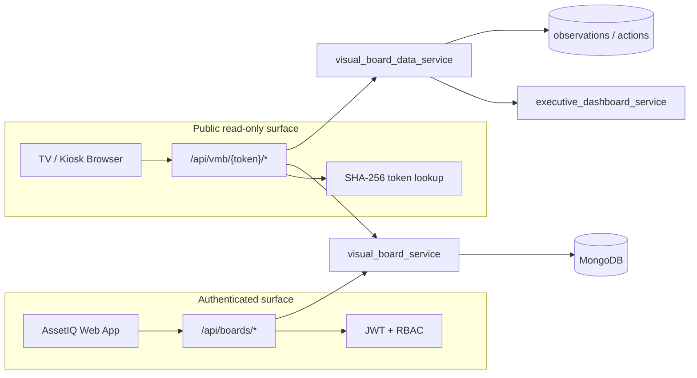

# AssetIQ Visual Management Studio — Technical Design

**Version:** 1.0  
**Date:** June 2026  
**Status:** Phase 1 implemented (backend)  
**Companion:** Functional spec in `ASSETIQ_VISUAL_MANAGEMENT_STUDIO_FUNCTIONAL_SPEC.md`

---

## 1. Architecture overview

Visual Management Studio (VMB) uses a **dual API surface** to isolate TV/display traffic from operational AssetIQ APIs.



### Design principles

1. **Public routes never accept JWT** — token validation is the only auth path for `/api/vmb/*`.
2. **Raw tokens returned once** — at publish/rotate; only `token_hash` is stored.
3. **Tenant scope from token** — display queries use `tenant_id` from the resolved token record, not from the caller.
4. **Widget data aggregation** — TVs call a single `/data` endpoint; the backend maps widget configs to scoped read queries.

---

## 2. MongoDB collections

All VMB collections carry `tenant_id` (Wave 10 tenant pilot).

### 2.1 `visual_boards`

Working board document. Draft edits mutate this collection; publish snapshots to `visual_board_versions`.

```json
{
  "id": "board_20260616120000abc",
  "tenant_id": "company_abc",
  "name": "Extrusion Reliability Board",
  "description": "",
  "status": "draft",
  "board_type": "reliability",
  "version": 0,
  "widgets": [],
  "layout": {"columns": 12, "row_height": 80},
  "theme": "dark",
  "refresh_interval_seconds": 30,
  "plant": null,
  "area": null,
  "created_by": "user_123",
  "created_at": "2026-06-16T12:00:00Z",
  "updated_at": "2026-06-16T12:00:00Z",
  "published_at": null
}
```

**Indexes:** `{tenant_id: 1, status: 1}`, `{tenant_id: 1, updated_at: -1}`

### 2.2 `visual_board_versions`

Immutable publish snapshots.

```json
{
  "id": "vbv_20260616130000xyz",
  "board_id": "board_20260616120000abc",
  "tenant_id": "company_abc",
  "version": 1,
  "layout": {},
  "widgets": [],
  "filters": {"plant": null, "area": null},
  "created_at": "2026-06-16T13:00:00Z",
  "created_by": "user_123"
}
```

**Indexes:** `{board_id: 1, version: -1}` (unique compound on board_id + version)

### 2.3 `visual_board_tokens`

Hashed display tokens.

```json
{
  "id": "vbt_20260616130000tok",
  "board_id": "board_20260616120000abc",
  "tenant_id": "company_abc",
  "token_hash": "a1b2c3…",
  "screen_name": "Control Room TV",
  "is_active": true,
  "version": 1,
  "created_at": "2026-06-16T13:00:00Z",
  "last_used_at": null
}
```

**Indexes:** `{token_hash: 1}` (unique), `{board_id: 1, is_active: 1}`

### 2.4 `visual_board_screens`

Device registry (Phase 3 stub in Phase 1).

```json
{
  "id": "vbs_20260616140000scr",
  "board_id": "board_20260616120000abc",
  "token_id": "vbt_20260616130000tok",
  "tenant_id": "company_abc",
  "screen_name": "Control Room TV",
  "location": "Building A",
  "device_id": null,
  "last_seen": "2026-06-16T14:00:00Z",
  "status": "online"
}
```

---

## 3. Token authentication

### 3.1 Generation

```python
raw = "vmb_" + secrets.token_hex(32)   # 256-bit entropy
token_hash = hashlib.sha256(raw.encode()).hexdigest()
```

- Prefix `vmb_` aids log filtering and route parsing.
- Store `token_hash` only; return `raw` in publish/rotate response body **once**.

### 3.2 Validation (public routes)

1. Strip optional `vmb_` prefix from URL path param.
2. Reconstruct full token if caller passed hash portion only.
3. Compute SHA-256, lookup `visual_board_tokens` where `token_hash` matches and `is_active == true`.
4. Load board + pinned version snapshot.
5. Build synthetic tenant user: `{"id": "vmb-display", "company_id": tenant_id, "role": "viewer"}`.
6. Update `last_used_at` on token (fire-and-forget).

### 3.3 Security constraints

| Constraint | Implementation |
|------------|----------------|
| No JWT on public routes | No `Depends(get_current_user)` on `/api/vmb/*` |
| Read-only | Data service only calls aggregation queries |
| Token scope | Token resolves to single board + tenant |
| Rotation | Deactivates prior active token(s) for board |
| Unpublish | Sets board status archived/draft, deactivates all tokens |

---

## 4. API contracts

Base path: `/api` (see `server.py`).

### 4.1 Authenticated — `/boards`

#### POST `/boards`

```json
// Request
{ "name": "Extrusion Reliability Board", "board_type": "reliability" }

// Response 201
{
  "id": "board_…",
  "name": "Extrusion Reliability Board",
  "status": "draft",
  "board_type": "reliability",
  "widgets": [ /* default reliability template */ ]
}
```

#### GET `/boards`

Query: `status`, `board_type`, `skip`, `limit`

#### PUT `/boards/{id}`

Partial update: name, description, widgets, layout, theme, refresh_interval_seconds, plant, area.

#### POST `/boards/{id}/publish`

Requires `vmb:publish`.

```json
// Response
{
  "board_id": "board_123",
  "version": 1,
  "token": "vmb_4fdce9f1fbc437f29f4d9e5c3e1c8a21",
  "url": "/vmb/vmb_4fdce9f1fbc437f29f4d9e5c3e1c8a21"
}
```

#### POST `/boards/{id}/rotate-token`

Deactivates current token, issues new raw token.

#### GET `/boards/{id}/preview-data`

Same payload shape as public `/data` but requires JWT + `vmb:read`.

### 4.2 Public — `/vmb/{token}`

#### GET `/vmb/{token}/layout`

```json
{
  "board_id": "board_123",
  "name": "Extrusion Reliability Board",
  "version": 1,
  "layout": {},
  "widgets": [],
  "refresh_interval_seconds": 30,
  "theme": "dark"
}
```

#### GET `/vmb/{token}/data`

```json
{
  "board_id": "board_123",
  "version": 1,
  "last_updated": "2026-06-16T14:00:00Z",
  "status": { "status": "GREEN", "reason": "No critical observations" },
  "widgets": {
    "w_active_exposure": {
      "type": "kpi_card",
      "value": 450000,
      "formatted_value": "€450K",
      "trend": "stable"
    },
    "w_status": { "type": "status_indicator", "status": "GREEN", "reason": "…" },
    "w_observations": { "type": "observation_list", "items": [] },
    "w_waterfall": { "type": "exposure_waterfall", "segments": [] }
  }
}
```

#### POST `/vmb/{token}/heartbeat`

```json
// Request (optional)
{ "screen_name": "Control Room TV", "device_id": "tv-01" }

// Response
{ "ok": true, "last_seen": "2026-06-16T14:00:00Z" }
```

---

## 5. Widget data adapter

`visual_board_data_service.py` maps widget `type` + `config` to data sources.

| Widget type | Phase 1 source | Notes |
|-------------|----------------|-------|
| `kpi_card` | `executive_dashboard_service.kpi_cards[metric]` | Metrics: `active_threat_exposure`, `critical_active_exposure`, `exposure_coverage`, `resolved_exposure`, `uncovered_exposure` |
| `status_indicator` | Custom engine over observations + actions | GREEN / AMBER / RED |
| `observation_list` | Scoped observations query | Top N by exposure |
| `exposure_waterfall` | `executive_dashboard_service.waterfall_data` + `exposure_metrics` | Summary segments |
| `action_queue` | Phase 2 | `central_actions` |
| `trend_chart` | Phase 4 | Time-series from dashboard snapshots |

### Status engine logic

```python
critical_obs_count = count(obs where severity == "critical" and status open)
critical_overdue_actions = count(actions where priority critical and overdue)

if critical_obs_count > 0 and critical_overdue_actions > 0:
    status = "RED"
elif critical_obs_count > 0:
    status = "AMBER"
else:
    status = "GREEN"
```

### Tenant context

```python
def _tenant_user(tenant_id: str) -> dict:
    return {"id": "vmb-display", "company_id": tenant_id, "role": "viewer"}
```

All queries use `merge_tenant_filter(..., tenant_user)`.

---

## 6. RBAC permissions

| Permission | Role mapping | Route usage |
|------------|--------------|-------------|
| `vmb:read` | viewer+ (all roles read) | GET boards, versions, preview-data |
| `vmb:write` | reliability_engineer+, owner, admin | POST/PUT/DELETE boards |
| `vmb:publish` | owner, admin (+ explicit grant Phase 3) | publish, unpublish, rotate-token |
| `vmb:admin` | owner, admin | screens management, templates (Phase 3+) |

### UI feature key

`visual_boards` in `permissions_defaults.FEATURES` maps to API category `vmb` for `read`/`write`/`delete` via `permission_resolver.API_TO_UI_FEATURE`.

`vmb:publish` and `vmb:admin` are in `API_ONLY_PERMISSIONS` (resolved via `rbac_service.ROLES`).

### Default matrix

| Role | read | write | publish | admin |
|------|------|-------|---------|-------|
| owner | ✓ | ✓ | ✓ | ✓ |
| admin | ✓ | ✓ | ✓ | ✓ |
| reliability_engineer | ✓ | ✓ | — | — |
| maintenance | ✓ | — | — | — |
| operations | ✓ | — | — | — |
| viewer | ✓ | — | — | — |

---

## 7. Default reliability template

On `POST /boards` with `board_type: reliability`, seed widgets:

| ID | Type | Title | Config |
|----|------|-------|--------|
| w_active_exposure | kpi_card | Active Exposure | metric: active_threat_exposure |
| w_critical_risks | kpi_card | Critical Risks | metric: critical_active_exposure |
| w_status | status_indicator | Reliability Status | — |
| w_observations | observation_list | Open Observations | limit: 10 |
| w_waterfall | exposure_waterfall | Exposure Waterfall | — |

---

## 8. Phased delivery

| Phase | Backend | Frontend |
|-------|---------|----------|
| **1** ✓ | Models, CRUD, publish, token auth, data adapter, tests | — |
| **2** | — | `/vmb/{token}` kiosk page, polling |
| **3** | Multiple tokens, screen CRUD, heartbeat analytics | Screen manager UI |
| **4** | Version rollback, template CRUD | Drag-and-drop designer |
| **5** | WebSocket hub | Realtime client, QR, analytics |

---

## 9. WebSocket future (Phase 5)

```
/ws/vmb/{token}
```

**Auth:** token in query string or first message; same hash lookup as REST.

**Events:**

| Event | Payload |
|-------|---------|
| `board_updated` | `{ board_id, version }` |
| `widget_updated` | `{ widget_id, data }` |
| `data_refreshed` | full `/data` payload |

**Fallback:** client polls `GET /api/vmb/{token}/data` every `refresh_interval_seconds` (default 30).

Implementation note: reuse existing `websockets` dependency; add `visual_board_ws_hub.py` that subscribes to domain events or periodic materializer ticks.

---

## 10. File map (Phase 1)

| File | Responsibility |
|------|----------------|
| `backend/models/visual_board.py` | Pydantic request/response models |
| `backend/services/visual_board_token.py` | Token generate, hash, validate |
| `backend/services/visual_board_service.py` | CRUD, publish, versions, screens stub |
| `backend/services/visual_board_data_service.py` | Widget data aggregation |
| `backend/routes/visual_boards.py` | Authenticated `/boards` routes |
| `backend/routes/visual_board_public.py` | Public `/vmb/{token}` routes |
| `backend/tests/test_visual_board_tokens.py` | Token unit tests |
| `backend/tests/test_visual_board_service.py` | Service unit tests |

---

## 11. Tenant schema registration

VMB collections added to `WAVE10_COLLECTIONS` in `tenant_schema.py`:

- `visual_boards`
- `visual_board_versions`
- `visual_board_tokens`
- `visual_board_screens`
