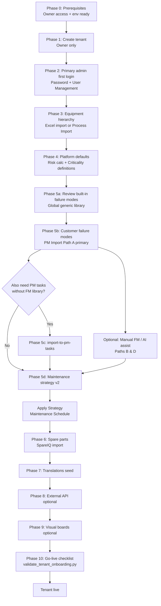

# AssetIQ Client Onboarding Playbook

Official runbook for operators and platform owners onboarding a new client (tenant) into AssetIQ. Follow phases in order unless a specific integration is explicitly out of scope.

For the in-app self-service onboarding experience (guided workspace, AI Coach, interactive demos, and customer-facing phases), see [`SELF_SERVICE_ONBOARDING_WORKSPACE_SPEC.md`](./SELF_SERVICE_ONBOARDING_WORKSPACE_SPEC.md). This playbook is the consultant/operator implementation guide; the spec defines the product vision and UX for customers configuring their own environment.

---

## 1. Overview

### What onboarding accomplishes

Client onboarding provisions an isolated tenant in AssetIQ, creates the primary administrator, establishes the ISO 14224 equipment hierarchy, loads customer-specific reliability data (failure modes and maintenance tasks), configures platform defaults, and optionally enables translations, external integrations, and visual boards. A successfully onboarded tenant can capture observations, run maintenance programs, and use StrategyIQ / SchedulingIQ with tenant-scoped data.

### Roles

| Role | Responsibility in onboarding |
|------|------------------------------|
| **Owner** | Platform-level tenant lifecycle: create tenant at **Settings → Tenant Management** (`/settings/tenant-management`), configure modules and AI settings, run validation. Owner-only; requires `tenant_management:admin`. |
| **Admin** | Client-side setup after tenant creation: first-login password change, user management, equipment hierarchy, risk/criticality settings, PM import, spare parts, translations seeding. Requires `admin` role within the tenant. |
| **Reliability engineer** | Domain configuration: failure mode library curation, PM import review, maintenance strategy v2, Apply Strategy, AI-assisted FM improvements. Has `library:write` and `scheduler:write` but cannot create tenants or manage users. |

Other roles (`maintenance`, `operations`, `viewer`) are assigned during user setup but are not primary onboarding actors.

---

## 2. Phase 0 — Prerequisites

Before creating or handing off a tenant, confirm:

1. **Owner access** to **Settings → Tenant Management** at `/settings/tenant-management`. Only users with role `owner` can access this page.
2. **Environment**: Backend has `MONGO_URL` and `DB_NAME` configured; startup seeding has run (global failure modes library, disciplines).
3. **CLI validation** (run after any phase to check tenant health):

```bash
cd backend && python scripts/validate_tenant_onboarding.py --tenant-id <TENANT_UUID>
```

Optional flags: `--all` (all tenants), `--include-archived`.

The script calls `run_validation_checks()` and reports `overall`: `valid`, `warnings`, `invalid`, or `missing`. It checks primary admin existence, user/tenant ID alignment, and equipment node counts.

Equivalent API (owner): `POST /admin/tenants/{tenant_id}/validate`

---

## 3. Phase 1 — Create tenant (owner only)

### UI path

**Settings → Tenant Management** → **Create tenant**

API: `POST /admin/tenants` (requires `tenant_management:admin`)

### Required fields

| Field | Notes |
|-------|-------|
| **Tenant name** | Display name |
| **Slug** | URL-safe identifier; auto-derived from name if omitted |
| **Primary admin name** | Full name of the client's first admin |
| **Primary admin email** | Must not already exist in `users` |
| **Default language** | Typically `en`, `nl`, or `de` |
| **Default timezone** | e.g. `UTC`, `Europe/Amsterdam` |

### Optional fields

| Field | Notes |
|-------|-------|
| **Plan** | Commercial/plan label (free text) |
| **Site name** | See naming quirk below |
| **Installation name** | See naming quirk below |
| **Module toggles** | Override defaults per module key |
| **AI enabled** | Sets `ai_settings.enabled` (default: on in UI) |
| **Notes** | Internal operator notes |
| **Return temp password** | UI requests temp password in create response |

### IMPORTANT — Site name vs Installation name

These labels are **misleading relative to ISO 14224 levels**:

| UI field | ISO 14224 level created | Notes |
|----------|-------------------------|-------|
| **Site name** | `installation` | Top-level site node; primary admin gets `assigned_installations: [site_id]` |
| **Installation name** | `plant_unit` | Child of the site (installation) node |

If only **Site name** is provided, one installation-level node is created. If both are provided, a plant unit is nested under that installation.

### Default modules

From `backend/services/tenant_registry.py` — all default to **enabled**:

| Key | Label |
|-----|-------|
| `observation_iq` | ObservationIQ |
| `strategy_iq` | StrategyIQ |
| `scheduling_iq` | SchedulingIQ |
| `digital_operator` | Digital Operator |
| `spare_iq` | Spares |
| `visual_boards` | Visual Boards |
| `ril_copilot` | RIL Copilot |
| `executive_dashboards` | Executive Dashboards |
| `ai_risk_analysis` | AI Risk Analysis |

Module catalog API: `GET /admin/tenants/modules/catalog`

### What tenant creation produces

1. **`tenants` document** — `tenant_id` (UUID), slug, status (`trial` by default), modules, AI settings, default language/timezone
2. **Primary admin user** — role `admin`, `must_change_password: true`, `company_id` and `tenant_id` set to tenant UUID; temporary password generated unless supplied
3. **Optional equipment nodes** — installation and/or plant_unit as described above

Hand the primary admin their email and temporary password securely (shown in UI alert when `return_temp_password` is true).

---

## 4. Phase 2 — Primary admin first login

### Password change

On first login, `FirstLoginFlow` enforces password change when `must_change_password` is true, then terms acceptance if required.

API: password change clears the flag via auth routes (`must_change_password: false` after successful change).

### User Management

**Settings → User Management** (`/settings/user-management`) — **admin and owner only**.

Actions for the primary admin:

1. Change own password (if not already done via first-login flow)
2. Invite additional users with roles: `admin`, `reliability_engineer`, `maintenance`, `operations`, `viewer`
3. Set **`assigned_installations`** — scopes which installation-level nodes a user can access (important for risk settings and scoped views)
4. Approve pending users and assign installations on approval

New users created by admin receive `must_change_password: true` and assigned installations from the create payload.

Available roles API: `GET /users/roles` — `owner`, `admin`, `reliability_engineer`, `maintenance`, `operations`, `viewer`

---

## 5. Phase 3 — Site & equipment hierarchy

### Equipment Manager

**Path**: `/equipment-manager`  
**Access**: Admin/owner for Excel import; page is **desktop only** (`desktopOnly: true` in nav). Reliability engineers can view/edit equipment via permissions but Excel import requires admin or owner.

Build or import the ISO 14224 hierarchy under each installation.

### Importable hierarchy levels

Below the selected **installation** (site), Excel import supports:

| Level key | Display label |
|-----------|---------------|
| `plant_unit` | Plant/Unit |
| `section_system` | Section/System |
| `equipment_unit` | Equipment Unit |
| `subunit` | Subunit |
| `maintainable_item` | Maintainable Item |

The installation itself is the import target (`installation_id`); it is not imported as a child row.

### Excel import

**UI**: Equipment Manager → Import Excel  
**API**: `POST /equipment-hierarchy/import-excel` with multipart file + `installation_id` form field

**No static equipment template file exists.** Prepare spreadsheets using either:

- **Export from Equipment Manager**: `GET /equipment-hierarchy/export` — download current hierarchy as Excel reference
- **Build from schema** (columns accepted by import service):

| Column | Required | Notes |
|--------|----------|-------|
| **Name** (or Line Item Name, Equipment Name) | Yes | Display name |
| **Level** (or ISO Level, Hierarchy Level) | Yes | See level table above; aliases like `plant`, `section`, `equipment` accepted |
| **ID** / Tag / Equipment Tag | Recommended | Equipment tag/identifier |
| **Parent** / Parent Name | Recommended | If omitted, hierarchy inferred from row order |
| **Full Path** / Path | Optional | Alternative parent resolution |
| **Equipment Type** | Optional | Equipment type label |
| **Description** | Optional | Free text |
| **Safety**, **Production**, **Environmental**, **Reputation** | Optional | Criticality scores 0–5; drives criticality level and risk score |

### Optional — Process Import (P&ID / diagrams)

**UI**: Equipment Manager → Process Import wizard (`ProcessImportWizard`)  
**API**: `POST /process-import/upload`

Supported: **PDF**, **PNG**, **JPG/JPEG**, **WEBP** (max **50 MB**). AI extracts ISO-aligned hierarchy candidates. Review items, then `POST /process-import/session/{session_id}/import` with `installation_id`.

Query options: `generate_subunits`, `generate_maintainable_items`, `estimate_criticality`.

---

## 6. Phase 4 — Platform defaults

### Auto-seeded at startup (global, not per-tenant)

| Data | Source | Collection |
|------|--------|------------|
| **Failure modes library** | `FAILURE_MODES_LIBRARY` static seed | `failure_modes` — `is_builtin: true`, `failure_mode_type: generic` |
| **Disciplines** | `seed_disciplines_if_empty()` | `disciplines` |

Default disciplines: **rotating**, **static**, **piping**, **electrical**, **instrumentation**, **civil**, **operations**, **laboratory**

Startup is handled in `backend/services/startup_lifecycle.py`.

### Per-tenant settings (admin configures)

| Setting | Path | Defaults |
|---------|------|----------|
| **Risk calculation** | `/settings/risk-calculation` | Criticality weight **0.75**, FMEA weight **0.25**; thresholds **70** (critical), **50** (high), **30** (medium) |
| **Criticality definitions** | `/settings/criticality-definitions` | Define 1–5 scale meanings for Safety, Production, Environmental, Reputation per tenant |

Risk settings are **per installation**; users must have the installation in `assigned_installations` to view/edit.

---

## 7. Phase 5 — Failure modes & maintenance strategy

### 5a Built-in vs customer failure modes

| Type | `failure_mode_type` | Origin | Typical use |
|------|---------------------|--------|-------------|
| **Built-in / generic** | `generic` | Startup seed from global library (`is_builtin: true`, `created_by: system`) | Industry baseline FMEA catalog |
| **Customer-specific** | `customer_specific` | PM Import, manual create, or FM linked/customized via import | Client's PM plan and plant-specific modes |

Filter in Library: `GET /failure-modes?failure_mode_type=customer_specific`

### 5b Customer failure modes upload

#### Path A — PM Import bulk (primary recommended path)

**UI**: **Library** (`/library`) → **PM Import** tab → **Import PM Plan** (`PMImportWizard`)

**Template**: `backend/static/templates/pm_import_template.xlsx`  
**Download**: `GET /pm-import/template`

**Template columns**: Tag, Task, Frequency, Discipline

**Upload**: `POST /pm-import/upload`  
Also accepts **PDF** and **images** (PNG, JPG, JPEG, WEBP) — max **20 MB**.

**Review workflow** (per extracted task):

1. **Link existing FM** — `POST /pm-import/session/{session_id}/task/{task_id}/select-match` with `match_id`
2. **Approve new FM** — `POST /pm-import/session/{session_id}/task/{task_id}/approve-new-fm` (failure_mode, equipment, category, S/O/D)
3. **Reject** — `POST /pm-import/session/{session_id}/task/{task_id}/reject`
4. Bulk accept/reject — `POST /pm-import/session/{session_id}/bulk-action`

**Final step — Import to Library**: `POST /pm-import/session/{session_id}/import`

Creates **`customer_specific`** failure modes with **`source: pm_import`** and recommended actions derived from PM tasks.

#### Path B — Manual Add Failure Mode

**UI**: Library → Add Failure Mode  
**API**: `POST /failure-modes`

Key fields (`FailureModeCreate`):

- `failure_mode`, `category`, `equipment` (required)
- `severity`, `occurrence`, `detectability` (1–10)
- `equipment_type_ids`, `recommended_actions`
- `failure_mode_type`: set to `"customer_specific"` for client-owned modes
- Optional: `process`, `potential_effects`, `potential_causes`, `iso14224_mechanism`, `keywords`, `description`

Default `failure_mode_type` if omitted: `generic`.

#### Path C — Export format (prep reference only)

**Download**: `GET /failure-modes/export` (Excel)

Export columns: **ID**, **Category**, **Equipment**, **Failure Mode**, **Process**, **Potential Effects**, **Potential Causes**, **ISO 14224 Mechanism**, **Severity**, **Occurrence**, **Detectability**, **RPN**, **Keywords**, **Recommended Actions**, **Validated**, **Source**

**There is no failure-modes Excel import endpoint.** Use export to understand structure or for offline review only.

#### Path D — AI assist (supplement)

Available in Library / Strategy tooling:

| Feature | Endpoint (representative) |
|---------|---------------------------|
| **Suggest Failure Modes** | `POST /ai-suggestions/new-failure-modes` |
| **Bulk Improve** | `POST /ai-suggestions/improve-failure-mode` (batch via UI) |
| **Improve with AI** | `POST /ai-suggestions/improve-failure-mode` (single FM) |

AI suggestions create or refine modes; review before treating as authoritative customer data.

### 5c PM plan import (maintenance tasks path)

Same template (`pm_import_template.xlsx`) and upload flow as Path A.

After review, promote accepted tasks to the **`pm_tasks`** collection (separate from failure mode library import):

**API**: `POST /pm-import/session/{session_id}/import-to-pm-tasks`

This writes PM tasks only — not `failure_modes`, `maintenance_programs`, or FMEA library entries.

### 5d Maintenance strategy v2 + Apply Strategy

1. Define **maintenance strategy** templates per equipment type in Library → Strategy (Maintenance Strategy Manager)
2. On the **Maintenance Schedule** tab, click **Apply Strategy** for the equipment type
3. **API**: `POST /maintenance-scheduler/apply-strategy/{equipmentTypeId}` with optional `equipment_ids` list

Apply Strategy creates/updates **maintenance_programs_v2**, program tasks, and reliability graph edges. Large batches may run as background job type `apply_strategy`.

---

## 8. Phase 6 — Spare parts (SpareIQ)

**Prerequisite**: Equipment hierarchy exists (spare parts link to equipment by tag/name).

**Template download**: `GET /spare-parts-import/template` → `spare_parts_import_template.xlsx`  
(Template is generated in memory — no static file in repo.)

| Column | Required |
|--------|----------|
| **Equipment** (tag or name) | Yes |
| **Spare Part Description** | Yes |
| **Type / Model** | Yes |
| **Manufacturer** | Optional |
| **Category** | Optional |
| **Component Position** | Optional |
| **Notes** | Optional |
| **Document URL** | Optional |

**Validate**: `POST /spare-parts-import/validate`  
**Import**: `POST /spare-parts-import/import`

Requires `spareiq:read` / write permissions per route auth inventory.

---

## 9. Phase 7 — Translations

**Settings → Translations** (`/settings/translations`)

Seed baseline locale support:

| Action | API |
|--------|-----|
| Seed languages (EN, NL, DE) | `POST /translations/languages/seed` |
| Seed technical dictionary | `POST /translations/dictionary/seed` |

Language seed creates English (default), Dutch, and German if not present. Dictionary seed adds mechanical and maintenance term translations (Bearing, Seal, Pump, Inspection, etc.).

Requires `library:write` for seed endpoints.

---

## 10. Phase 8 — Integrations (optional)

**Settings → External API Access** (`/settings/external-api`) — **admin and owner only**.

| Capability | Details |
|------------|---------|
| **API keys** | `POST /admin/external-api/keys` — key shown once on create |
| **Scopes** | `observations:create` (default), `equipment:read` |
| **Rate limits** | Default 120 req/min; optional IP allowlist |
| **External endpoint** | `POST /api/v1/external/observations`, equipment read routes |
| **Integration guide** | Download from UI (client-side generated markdown via `externalObservationIntegrationGuide.js`) — safe to share with vendors; contains no secrets |

Rotate/revoke: `POST /admin/external-api/keys/{key_id}/rotate`, `/revoke`

---

## 11. Phase 9 — Visual boards (optional)

Requires module `visual_boards` enabled on tenant.

**Settings → Visual Management** (`/settings/visual-management/boards`)

| Area | Path |
|------|------|
| **Boards** | `/settings/visual-management/boards` |
| **Templates** | `/settings/visual-management/templates` |
| **Screens** | `/settings/visual-management/screens` |
| **Pair displays** | `/settings/visual-management/pair-displays` |
| **Analytics** | `/settings/visual-management/analytics` |

Workflow: create or clone template → create board → pair physical displays for kiosk/shop-floor mode.

---

## 12. Phase 10 — Go-live checklist

Run before handing the tenant to the client for production use.

### Validation

- [ ] `python scripts/validate_tenant_onboarding.py --tenant-id <TENANT_UUID>` returns `overall: valid` (or acceptable warnings documented)
- [ ] Tenant Health card in Tenant Management shows passing checks (registry, primary admin, sites, equipment)

### Maintenance readiness

**Settings → Maintenance Readiness** (`/settings/maintenance-readiness`) or `GET /admin/maintenance-readiness`

Review:

- [ ] `strategy_needs_apply_count` is 0 (all strategies applied)
- [ ] `active_strategies` and `v2_program_count` align with expectations
- [ ] Background job queue healthy
- [ ] Legacy maintenance program flags appropriate for environment

### Minimum functional checklist

- [ ] Primary admin completed password change; additional users invited with correct roles and `assigned_installations`
- [ ] At least one **installation**-level site with equipment hierarchy under it
- [ ] Criticality and/or risk settings reviewed per installation
- [ ] Customer failure modes loaded (PM Import or manual) where required
- [ ] Maintenance strategy applied for key equipment types
- [ ] Translations seeded if multi-language deployment
- [ ] External API keys created and integration guide shared (if integrations in scope)
- [ ] Visual boards configured (if module enabled)

---

## 13. Template summary table

| Template / export | File path (if static) | Download method | Import supported |
|-------------------|----------------------|-----------------|------------------|
| PM Import | `backend/static/templates/pm_import_template.xlsx` | `GET /pm-import/template` | Yes — `POST /pm-import/upload` → review → `POST /pm-import/session/{id}/import` (FM library) or `.../import-to-pm-tasks` (PM tasks) |
| Spare parts | *(generated in memory)* | `GET /spare-parts-import/template` | Yes — `POST /spare-parts-import/import` |
| Equipment hierarchy | *(no static template)* | `GET /equipment-hierarchy/export` (reference export) | Yes — `POST /equipment-hierarchy/import-excel` |
| Failure modes | *(no template)* | `GET /failure-modes/export` | **No** — export only |
| Process Import | *(no template)* | N/A | Yes — `POST /process-import/upload` → review → `POST /process-import/session/{id}/import` |
| External API guide | *(client-generated)* | UI download on External API page | N/A |

---

## 14. Recommended onboarding order



### Operator quick reference — phase ownership

| Phase | Primary actor |
|-------|---------------|
| 0–1 | Owner |
| 2–4 | Admin |
| 5 | Reliability engineer (+ admin for approvals) |
| 6–7 | Admin |
| 8–9 | Admin (optional) |
| 10 | Owner + admin |

---

*Document version: 2026-06-30. Derived from AssetIQ codebase (`tenant_management_service.py`, `tenant_registry.py`, `equipment_import_excel.py`, `pm_import` routes, `failure_modes` routes, `spare_parts_import_service.py`, `translations` routes, and related frontend settings pages).*
