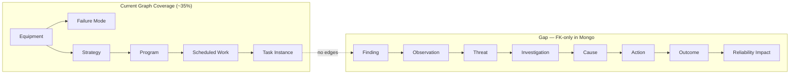
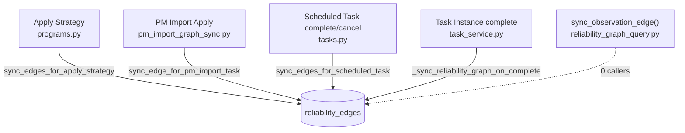
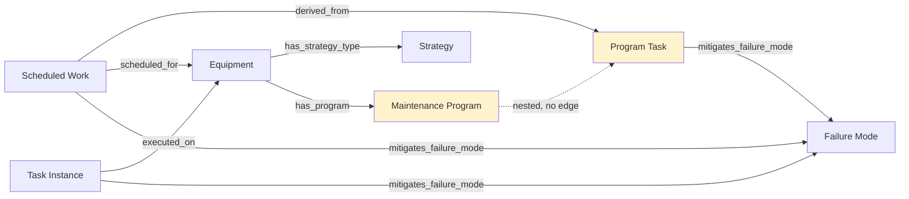
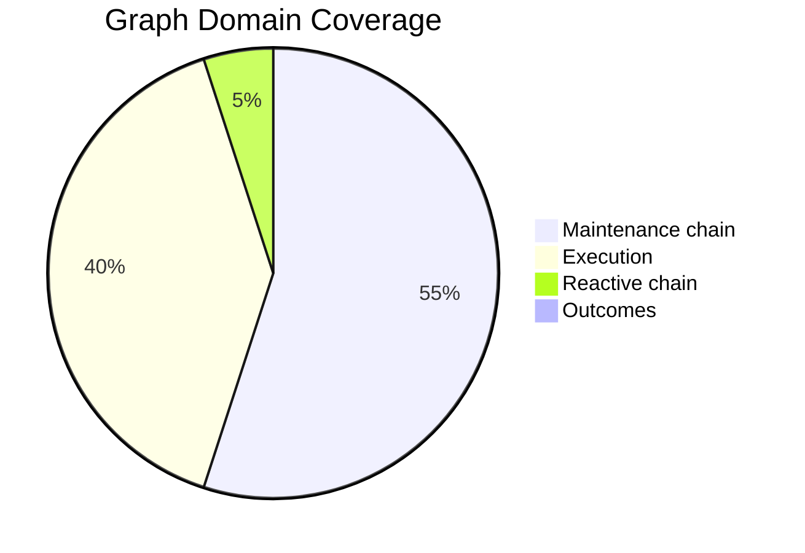
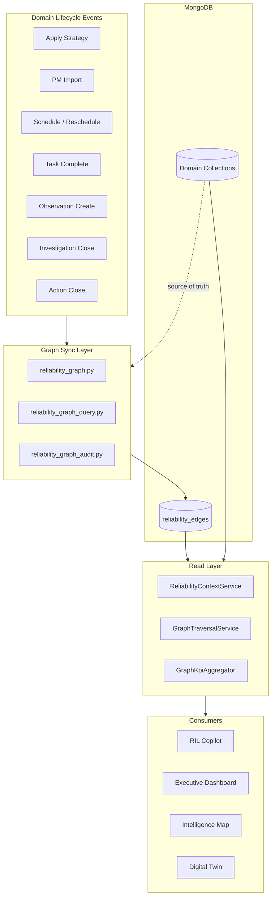
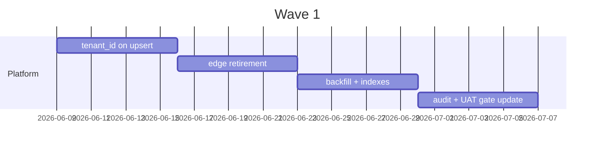
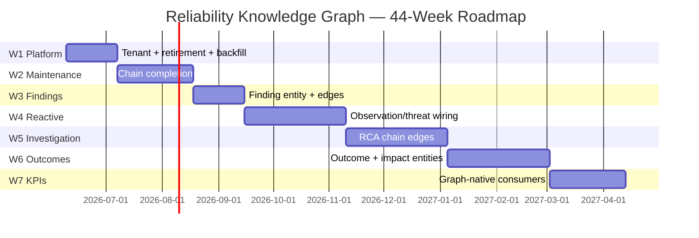
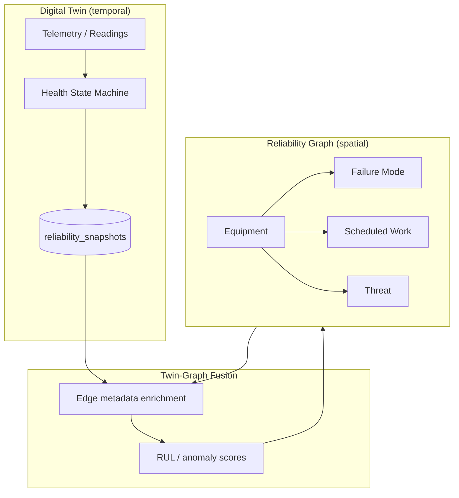
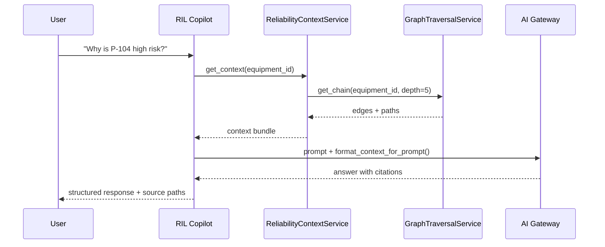
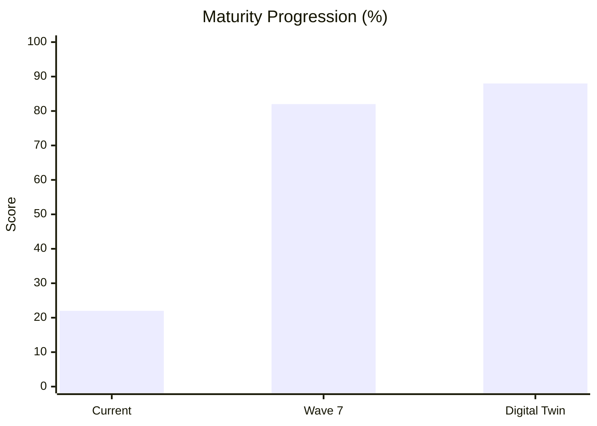

# Reliability Knowledge Graph — Implementation Plan

**AssetIQ Platform · Architecture Document**  
**Version:** 1.0 · **Date:** 2026-06-06  
**Status:** Approved for execution planning  
**Scope:** MongoDB edge-only graph (`reliability_edges`) — not Neo4j

---

## Executive Summary

AssetIQ already materializes a **maintenance-centric reliability graph** in MongoDB. The graph connects equipment through strategy, programs, scheduled work, and task completion — but stops before the reactive reliability chain (findings → observations → threats → investigations → actions → outcomes). Only **RIL Copilot** consumes graph-enriched context today; executive KPIs, AI risk, and chat operate on raw Mongo collections with foreign-key joins.

This plan closes the gap between the **current partial graph** and the **target end-to-end reliability chain**, in seven delivery waves over ~18 months, without migrating to a dedicated graph database. The edge store remains the traversal layer; domain documents remain the source of truth.



**Key decision:** Extend the existing `reliability_edges` pattern (upsert-on-event, equipment-scoped index) rather than introduce Neo4j. Complexity stays in sync hooks and read-side traversal; operational cost stays low.

---

## Phase 1 — Audit

### 1.1 Graph Store Architecture

| Attribute | Finding |
|-----------|---------|
| **Store** | MongoDB collection `reliability_edges` |
| **Model** | Edge-only (no node documents); nodes implied by `source_type`/`source_id` and `target_type`/`target_id` |
| **Identity** | Composite key: `{source_type}:{source_id}:{relation}:{target_type}:{target_id}` |
| **Indexing** | `equipment_id` denormalized on edges for equipment-scoped reads via `get_edges_for_equipment()` |
| **Tenant isolation** | **Missing** — `upsert_edge()` does not set `tenant_id`; queries are not tenant-scoped |
| **Lifecycle** | Upsert only; **no edge deletion** on entity retire, strategy resync, or program deactivation |
| **Strict mode** | `RELIABILITY_GRAPH_AUDIT_MODE=true` re-raises sync failures (PM import, task completion) |

**Primary code paths:**

| File | Role |
|------|------|
| [`backend/services/reliability_graph.py`](../../backend/services/reliability_graph.py) | Write API: `upsert_edge`, sync functions, `get_edges_for_equipment` |
| [`backend/services/reliability_graph_query.py`](../../backend/services/reliability_graph_query.py) | Read-side context; `sync_observation_edge()` (**zero callers**) |
| [`backend/services/reliability_graph_audit.py`](../../backend/services/reliability_graph_audit.py) | UAT audit helpers, `sample_db_audit()` |
| [`backend/services/reliability_context_service.py`](../../backend/services/reliability_context_service.py) | Equipment-centric bundle for AI (graph + FM + work + threats) |
| [`docs/platform/RELIABILITY_GRAPH_SYNC.md`](RELIABILITY_GRAPH_SYNC.md) | Sync hook documentation and UAT gate |

### 1.2 Write Paths (4 Active)



| # | Trigger | Function | Hook Location |
|---|---------|----------|---------------|
| 1 | Apply Strategy | `sync_edges_for_apply_strategy` | `backend/routes/maintenance_scheduler/programs.py` (~L254) |
| 2 | PM Import apply | `sync_edge_for_pm_import_task` | `backend/services/pm_import_graph_sync.py` |
| 3 | Scheduled task complete/cancel | `sync_edges_for_scheduled_task` | `backend/routes/maintenance_scheduler/tasks.py` (~L221, ~L338) |
| 4 | Task instance complete | `_sync_reliability_graph_on_complete` | `backend/services/task_service.py` (~L906) |

**Critical gap:** Scheduled task edges are written only on **complete** or **cancel** — not on creation or reschedule. The maintenance planner horizon (`scheduled_tasks` at creation) is invisible to the graph until terminal lifecycle events.

### 1.3 Node Inventory (10 Logical Types — Active)

| Node Type | Mongo Source Collection | In Graph? | Notes |
|-----------|------------------------|-----------|-------|
| `equipment` | `equipment_nodes` | ✅ | Source and target |
| `equipment_type_strategy` | `equipment_type_strategies` | ✅ | Via `has_strategy_type` |
| `maintenance_program_v2` | `maintenance_programs_v2` | ✅ | Via `has_program` |
| `program_task` | nested in `maintenance_programs_v2.tasks` | ✅ | Source only |
| `strategy_task_template` | nested in strategy | ✅ | Via `derived_from_template` |
| `failure_mode` | `failure_modes` | ✅ | Target for mitigation edges |
| `pm_import_task` | PM import staging | ✅ | Via `applied_to` |
| `scheduled_task` | `scheduled_tasks` | ✅ | Partial — lifecycle only |
| `task_instance` | `task_instances` | ✅ | On complete only |
| `observation` | `observations` / `threats` | ⚠️ | **Defined in `sync_observation_edge()`, never called** |

### 1.4 Relation Inventory (13 Defined, 10 Active)

| Relation | Source → Target | Active? | Write Path |
|----------|-----------------|---------|------------|
| `has_strategy_type` | equipment → equipment_type_strategy | ✅ | Apply Strategy |
| `has_program` | equipment → maintenance_program_v2 | ✅ | Apply Strategy |
| `derived_from_template` | program_task → strategy_task_template | ✅ | Apply Strategy |
| `mitigates_failure_mode` | program_task / scheduled_task / task_instance → failure_mode | ✅ | Apply Strategy, Scheduled Task, Task Instance |
| `applied_to` | pm_import_task → failure_mode | ✅ | PM Import |
| `derived_from` | scheduled_task → program_task | ✅ | Scheduled Task (complete/cancel) |
| `scheduled_for` | scheduled_task → equipment | ✅ | Scheduled Task (complete/cancel) |
| `completed_on` | scheduled_task → equipment | ✅ | Scheduled Task complete |
| `cancelled_for` | scheduled_task → program_task | ✅ | Scheduled Task cancel |
| `executed_on` | task_instance → equipment | ✅ | Task Instance complete |
| `observed_on` | observation → equipment | ❌ | Dead code |
| `indicates_failure_mode` | observation → failure_mode | ❌ | Dead code |
| `linked_to_threat` | observation → threat | ❌ | Dead code |

### 1.5 Maintenance Chain Coverage



**Partial links identified:**

- Equipment → Failure Mode: **indirect only** (via program_task or scheduled_task mitigation edges)
- Program → Program Task: **no edge** (tasks nested in program document)
- Scheduled Work at creation: **no edges** until complete/cancel
- Task Instance → Scheduled Work: **no edge** (FK `scheduled_task_id` in Mongo only)
- Task Completion → Finding: **no edge** (`findings` string field on scheduled_task / task_instance)
- Finding → Observation: **no edge** (task completion creates `threats` doc via `_create_observation_from_task`, no graph sync)

### 1.6 Reactive Chain Coverage (FK-Only)

The observation → threat → investigation → action chain exists in Mongo via foreign keys, not graph edges:

| Link | Mechanism | Graph Edge? |
|------|-----------|-------------|
| Observation → Equipment | `equipment_id`, `asset` fields | ❌ (`observed_on` unused) |
| Observation → Failure Mode | `failure_mode_id` field | ❌ (`indicates_failure_mode` unused) |
| Observation ↔ Threat | `threat_id`, `observation_id` cross-refs | ❌ |
| Threat → Investigation | `investigations.threat_id` | ❌ |
| Investigation → Cause | `cause_nodes.investigation_id` | ❌ |
| Investigation → Action | `central_actions.source_type=investigation` | ❌ |
| Action → Equipment | `linked_equipment_id` | ❌ |
| **Outcome** | **Entity does not exist** | ❌ |
| **Reliability Impact** | **No first-class entity** | ❌ |

Reference: [`docs/data_model_relationships.md`](../data_model_relationships.md) describes FK relationships; graph section (L150–166) lists only maintenance edges.

### 1.7 AI / KPI Consumption Audit

| Consumer | Graph-Aware? | Data Source |
|----------|--------------|-------------|
| **RIL Copilot** | ✅ Yes | `ReliabilityContextService` → `get_edges_for_equipment` + raw Mongo for threats/work |
| **RIL Executive Dashboard** | ⚠️ Partial | `compute_executive_reliability_kpis()` queries `threats`, `scheduled_tasks`, `task_instances`; edge count is display-only |
| **Intelligence Map** | ⚠️ Partial | `reliability_edges_total` count; no traversal |
| **AI Risk Engine** | ❌ No | Raw Mongo + LLM prompts |
| **Chat / Threat Creation** | ❌ No | Direct `threats`/`actions` inserts |
| **Executive Briefings (RCA)** | ❌ No | Investigation documents via prompts |

`ReliabilityContextService` ([`reliability_context_service.py`](../../backend/services/reliability_context_service.py)) is the **only** graph-aware AI assembly path. It merges:

1. Graph edges (equipment-scoped)
2. Failure modes from strategy (Mongo, not graph)
3. Open work items (`work_item_query`)
4. Open threats (Mongo FK queries on `linked_equipment_id` / `asset`)

Threats and observations are **not** traversed via graph edges despite `sync_observation_edge()` being implemented.

### 1.8 Operational Gaps Summary

| Gap | Severity | Impact |
|-----|----------|--------|
| No `tenant_id` on edges | **High** | Multi-tenant leakage risk on graph reads |
| No edge deletion | **High** | Stale edges after strategy resync, program deactivation |
| Scheduled tasks only on terminal events | **Medium** | Planner horizon invisible to graph traversal |
| `sync_observation_edge()` uncalled | **High** | Reactive chain disconnected from graph |
| No Outcome entity | **Medium** | Cannot close the reliability loop in data model |
| Executive KPIs bypass graph | **Medium** | KPI and Copilot tell different stories |
| Program → Program Task missing | **Low** | Traversal requires Mongo fallback |

---

## Phase 2 — Completeness Scores

Scoring methodology: each hop in the target chain scores **0** (missing), **0.5** (FK-only or partial sync), or **1.0** (graph edge with audit coverage).

### 2.1 Target Chain Scorecard

**Target chain:**  
Equipment → Failure Mode → Strategy → Maintenance Program → Program Task → Scheduled Work → Task Instance → Task Completion → Finding → Observation → Threat → Investigation → Cause → Action → Outcome → Reliability Impact

| Hop | Score | Rationale |
|-----|-------|-----------|
| Equipment → Failure Mode | 0.5 | Indirect via `mitigates_failure_mode` on program_task/scheduled_task; no direct `equipment → failure_mode` edge |
| Failure Mode → Strategy | 0.5 | Strategy embeds FM strategies; no graph edge |
| Strategy → Maintenance Program | 0.5 | `has_strategy_type` + `has_program` exist; program not linked to strategy node directly |
| Maintenance Program → Program Task | 0.0 | Tasks nested; no edge |
| Program Task → Scheduled Work | 0.5 | `derived_from` written only on scheduled_task complete/cancel |
| Scheduled Work → Task Instance | 0.0 | FK only (`scheduled_task_id`) |
| Task Instance → Task Completion | 0.5 | Completion implied by `executed_on` edge; no explicit completion node |
| Task Completion → Finding | 0.0 | `findings` text field; no entity or edge |
| Finding → Observation | 0.0 | Task creates threat doc; no graph link |
| Observation → Threat | 0.5 | FK cross-refs; `linked_to_threat` unused |
| Threat → Investigation | 0.0 | FK `investigations.threat_id` |
| Investigation → Cause | 0.0 | `cause_nodes` collection FK |
| Cause → Action | 0.0 | Actions linked via `source_type`/`source_id` |
| Action → Outcome | 0.0 | Outcome entity does not exist |
| Outcome → Reliability Impact | 0.0 | No entity |

**Chain completeness: 3.0 / 15.0 = 20%** (FK-only hops counted at half credit)

### 2.2 Domain Completeness Scores

| Domain | Score | Weight | Weighted |
|--------|-------|--------|----------|
| **Maintenance (preventive)** | 55% | 30% | 16.5% |
| **Execution (task instances)** | 40% | 20% | 8.0% |
| **Reactive (obs/threat/inv)** | 5% | 25% | 1.25% |
| **Outcomes & impact** | 0% | 15% | 0% |
| **Platform (tenant, audit, delete)** | 25% | 10% | 2.5% |
| **Overall** | | | **28.3%** |

### 2.3 Consumer Readiness

| Consumer | Graph Readiness | Notes |
|----------|-----------------|-------|
| RIL Copilot | 60% | Edges + raw Mongo hybrid |
| RIL Dashboard | 15% | Count only |
| Intelligence Map | 10% | Aggregate count |
| AI Risk | 0% | No graph |
| Executive KPIs | 0% | Raw Mongo |
| Digital Twin (future) | 5% | No time-series edge metadata |



---

## Phase 3 — Design (Ontology)

### 3.1 Design Principles

1. **Edge-only MongoDB graph** — retain `reliability_edges`; no Neo4j migration.
2. **Event-sourced sync** — every edge written by a domain lifecycle hook (same 4-path pattern, extended).
3. **Nodes are lightweight** — identity + type only; attributes stay in source collections.
4. **Tenant-scoped edges** — `tenant_id` required on all new and backfilled edges.
5. **Soft retirement** — mark edges `status: retired` rather than hard delete (audit trail).
6. **Traversability over duplication** — graph links entities; KPIs aggregate via traversal + Mongo projections.

### 3.2 Target Ontology — Node Types (16)

| Node Type | Collection | Phase |
|-----------|------------|-------|
| `equipment` | `equipment_nodes` | Existing |
| `failure_mode` | `failure_modes` | Existing |
| `equipment_type_strategy` | `equipment_type_strategies` | Existing |
| `maintenance_program_v2` | `maintenance_programs_v2` | Existing |
| `program_task` | nested in program | Existing |
| `strategy_task_template` | nested in strategy | Existing |
| `scheduled_task` | `scheduled_tasks` | Existing |
| `task_instance` | `task_instances` | Existing |
| `task_completion` | new lightweight doc or composite | Wave 2 |
| `finding` | new `findings` collection or embedded ref | Wave 3 |
| `observation` | `observations` | Wave 4 |
| `threat` | `threats` | Wave 4 |
| `investigation` | `investigations` | Wave 5 |
| `cause` | `cause_nodes` | Wave 5 |
| `action` | `central_actions` | Wave 5 |
| `outcome` | new `outcomes` collection | Wave 6 |
| `reliability_impact` | new `reliability_impacts` collection | Wave 6 |

### 3.3 Target Ontology — Relation Types (28)

#### Maintenance Domain (existing + new)

| Relation | Source → Target | Event |
|----------|-----------------|-------|
| `has_failure_mode` | equipment → failure_mode | Apply Strategy (new) |
| `has_strategy_type` | equipment → equipment_type_strategy | Apply Strategy |
| `governed_by` | maintenance_program_v2 → equipment_type_strategy | Apply Strategy (new) |
| `has_program` | equipment → maintenance_program_v2 | Apply Strategy |
| `contains_task` | maintenance_program_v2 → program_task | Apply Strategy (new) |
| `derived_from_template` | program_task → strategy_task_template | Apply Strategy |
| `mitigates_failure_mode` | program_task / scheduled_task / task_instance → failure_mode | Various |
| `applied_to` | pm_import_task → failure_mode | PM Import |
| `derived_from` | scheduled_task → program_task | Scheduled Task create + lifecycle |
| `scheduled_for` | scheduled_task → equipment | Scheduled Task create + lifecycle |
| `instantiated_as` | scheduled_task → task_instance | Bridge / task instance create (new) |
| `executed_on` | task_instance → equipment | Task Instance complete |
| `completed_on` | scheduled_task → equipment | Scheduled Task complete |
| `cancelled_for` | scheduled_task → program_task | Scheduled Task cancel |

#### Reactive Domain (new)

| Relation | Source → Target | Event |
|----------|-----------------|-------|
| `yielded_finding` | task_completion → finding | Task complete with findings |
| `raised_observation` | finding → observation | Finding triage |
| `observed_on` | observation → equipment | Observation create |
| `indicates_failure_mode` | observation → failure_mode | FM link |
| `escalated_to` | observation → threat | Threat promotion |
| `linked_to_threat` | observation → threat | Legacy compat |
| `triggered_investigation` | threat → investigation | Investigation open |
| `identified_cause` | investigation → cause | RCA complete |
| `generated_action` | investigation / cause → action | Action create |
| `assigned_to_equipment` | action → equipment | Action create |
| `resulted_in` | action → outcome | Action close with outcome |
| `impacted_reliability` | outcome → reliability_impact | Outcome verification |
| `affects_equipment` | reliability_impact → equipment | Impact attribution |

### 3.4 Edge Document Schema (v2)

```json
{
  "id": "task_instance:abc:executed_on:equipment:xyz",
  "tenant_id": "company_123",
  "source_type": "task_instance",
  "source_id": "abc",
  "relation": "executed_on",
  "target_type": "equipment",
  "target_id": "xyz",
  "equipment_id": "xyz",
  "equipment_type_id": "et_456",
  "status": "active",
  "metadata": {
    "event": "completed",
    "completed_at": "2026-06-06T12:00:00Z",
    "strategy_version": "3.2"
  },
  "created_at": "2026-06-01T10:00:00Z",
  "updated_at": "2026-06-06T12:00:00Z",
  "retired_at": null
}
```

**Indexes (add):**

- `{ tenant_id: 1, equipment_id: 1, status: 1, updated_at: -1 }`
- `{ tenant_id: 1, source_type: 1, source_id: 1 }`
- `{ tenant_id: 1, target_type: 1, target_id: 1 }`
- `{ tenant_id: 1, relation: 1 }`

### 3.5 Target Architecture



### 3.6 Traversal API (new service)

Introduce `GraphTraversalService` (read-only) with:

- `get_chain(equipment_id, depth, relations[])` — bounded BFS from equipment
- `get_upstream(node_type, node_id)` — provenance (e.g., action → investigation → threat → task)
- `get_downstream(node_type, node_id)` — impact (e.g., equipment → open threats → pending actions)
- `explain_risk(equipment_id)` — structured path for Copilot prompts

Implementation stays in [`reliability_graph_query.py`](../../backend/services/reliability_graph_query.py); write functions remain in [`reliability_graph.py`](../../backend/services/reliability_graph.py).

---

## Phase 4 — Delivery Waves

### Wave 1 — Platform Hardening (Weeks 1–4)

**Goal:** Make the existing graph production-safe for multi-tenant deployment.

| Deliverable | Detail |
|-------------|--------|
| Add `tenant_id` to `upsert_edge` | Thread from caller context via `with_tenant_id` pattern ([`tenant_schema.py`](../../backend/services/tenant_schema.py)) |
| Edge retirement | `retire_edges_for_entity(source_type, source_id)` sets `status: retired` |
| Strategy resync cleanup | Retire stale program_task edges on program deactivation |
| Backfill script | `scripts/backfill_reliability_edge_tenant.py` |
| Audit extension | Tenant-scoped `sample_db_audit()` |
| Index creation | Add compound indexes per §3.4 |

**Exit criteria:** UAT gate passes with tenant filter; zero cross-tenant edges in sample audit.



---

### Wave 2 — Maintenance Chain Completion (Weeks 5–10)

**Goal:** Close gaps in the preventive maintenance chain.

| Deliverable | Detail |
|-------------|--------|
| `contains_task` edges | Emit on Apply Strategy for each program task |
| `governed_by` edge | program → strategy |
| `has_failure_mode` edge | equipment → failure_mode from strategy FM list |
| Scheduled task on **create** | Call `sync_edges_for_scheduled_task` at schedule time (event=`created`) |
| `instantiated_as` edge | scheduled_task → task_instance on bridge |
| Task completion node | Lightweight `task_completion` ref in edge metadata |
| Extend audit | `audit_scheduled_task_created()`, bridge coverage |

**Exit criteria:** Full chain Equipment → … → Task Instance traversable via edges alone for ≥90% of active equipment (sample audit).

---

### Wave 3 — Findings Layer (Weeks 11–14)

**Goal:** Materialize findings as first-class graph nodes.

| Deliverable | Detail |
|-------------|--------|
| `findings` collection (or normalized refs) | Structured finding from task/scheduled completion `findings` + form submissions |
| `yielded_finding` edge | task_completion → finding |
| Sync on complete | Extend `_sync_reliability_graph_on_complete` and scheduled task complete route |
| Finding → equipment edge | `found_on` relation |

**Exit criteria:** Completed tasks with non-empty findings have graph path to finding node.

---

### Wave 4 — Reactive Chain Entry (Weeks 15–22)

**Goal:** Wire observation/threat chain into graph (activate dead code).

| Deliverable | Detail |
|-------------|--------|
| Wire `sync_observation_edge()` | Call from observation create/update, threat convert, task `_create_observation_from_task` |
| `raised_observation` edge | finding → observation when triaged from maintenance |
| `escalated_to` edge | observation → threat |
| Threat create/update sync | New `sync_threat_edges()` in reliability_graph.py |
| Extend `ReliabilityContextService` | Include observation/threat edges in graph summary |
| Audit | `audit_observation_edges()`, threat linkage checks |

**Exit criteria:** Observations created from task execution appear in equipment graph within same request; `sync_observation_edge` has ≥3 call sites.

---

### Wave 5 — Investigation & Action Chain (Weeks 23–30)

**Goal:** Close the RCA loop in the graph.

| Deliverable | Detail |
|-------------|--------|
| `triggered_investigation` | threat → investigation on investigation create |
| `identified_cause` | investigation → cause on RCA complete |
| `generated_action` | investigation/cause → action |
| `assigned_to_equipment` | action → equipment |
| Investigation route hooks | Wire sync in investigation lifecycle endpoints |
| Action route hooks | Wire sync in `central_actions` create/close |
| Timeline API | Graph-backed `/equipment/{id}/reliability-chain` endpoint |

**Exit criteria:** Closed investigation with actions produces traversable path threat → investigation → cause → action in graph audit.

---

### Wave 6 — Outcomes & Reliability Impact (Weeks 31–38)

**Goal:** Introduce closing the loop — the missing Outcome entity.

| Deliverable | Detail |
|-------------|--------|
| `outcomes` collection | `{ id, action_id, verification_status, verified_at, effectiveness, notes }` |
| `reliability_impacts` collection | `{ id, outcome_id, equipment_id, metric_type, delta, window_days }` |
| `resulted_in` edge | action → outcome on action close with verification |
| `impacted_reliability` edge | outcome → reliability_impact |
| `affects_equipment` edge | reliability_impact → equipment |
| MTBF proxy migration | Feed `compute_executive_reliability_kpis` from impact edges |

**Exit criteria:** Action close with verified outcome creates 3-hop path to equipment impact; executive MTBF proxy optionally sourced from graph.

---

### Wave 7 — Graph-Native KPIs & Intelligence Map (Weeks 39–44)

**Goal:** Align all reliability consumers to graph traversal.

| Deliverable | Detail |
|-------------|--------|
| `GraphKpiAggregator` | Replace ad-hoc counts in executive dashboard |
| Intelligence Map traversal | Edge relation breakdown + chain depth metrics |
| AI Risk graph context | Inject `GraphTraversalService.explain_risk()` into risk prompts |
| Chat enrichment | Optional graph context on equipment-scoped chat |
| `count_edges_by_relation()` | Tenant-scoped ([`reliability_graph_query.py`](../../backend/services/reliability_graph_query.py)) |
| Deprecation | Mark raw Mongo KPI paths as fallback only |

**Exit criteria:** Executive dashboard and Copilot reference same open-threat count for sample equipment set (±0 variance).

---

### Wave Summary Timeline



---

## Phase 5 — Digital Twin Integration

### 5.1 Concept

The Digital Twin layer adds **time-indexed state** to graph nodes — transforming the reliability graph from a static relationship map into a **living model** of asset health over time.



### 5.2 Data Model Extension

New collection: `reliability_snapshots`

```json
{
  "equipment_id": "eq_123",
  "tenant_id": "company_456",
  "snapshot_at": "2026-06-06T00:00:00Z",
  "health_score": 72,
  "open_threat_count": 3,
  "overdue_pm_count": 1,
  "active_failure_modes": ["fm_1", "fm_2"],
  "edge_fingerprint": "hash_of_active_edges",
  "telemetry_summary": { "vibration_rms": 4.2, "temperature_c": 68 }
}
```

### 5.3 Graph ↔ Twin Bindings

| Binding | Mechanism |
|---------|-----------|
| Edge recency | `metadata.completed_at`, `metadata.event` on edges (already started) |
| Snapshot ↔ edges | `edge_fingerprint` hashes active edge IDs for equipment at snapshot time |
| Impact replay | Walk `reliability_impact → outcome → action` edges backward from snapshot degradation events |
| Predicted failures | Twin RUL scores attached as `metadata.twin_rul_days` on `equipment → failure_mode` edges |

### 5.4 Delivery (Post-Wave 7)

| Milestone | Description | Dependency |
|-----------|-------------|------------|
| DT-1 | Snapshot job on daily cron per equipment | Wave 7 KPI aggregator |
| DT-2 | Time-travel API: graph state at timestamp T | Snapshot + edge `created_at`/`retired_at` |
| DT-3 | Twin-enriched Copilot: "What changed this week?" | ReliabilityContextService + snapshots |
| DT-4 | Predictive edge annotations from AI Risk | Wave 7 AI Risk integration |

### 5.5 Digital Twin Maturity Target

| Capability | Current | Target (DT-4) |
|------------|---------|---------------|
| Static relationship map | ✅ | ✅ |
| Time-indexed graph state | ❌ | ✅ |
| Telemetry fusion | ❌ | ✅ |
| Counterfactual simulation | ❌ | ⚠️ Phase 2 twin |

---

## Phase 6 — AI Integration

### 6.1 Current AI ↔ Graph Matrix

| AI Surface | File | Graph Usage | Target |
|------------|------|-------------|--------|
| RIL Copilot | [`ril_copilot_service.py`](../../backend/services/ril_copilot_service.py) | `ReliabilityContextService` | Full chain traversal + twin |
| AI Risk Engine | `ai_risk_engine.py` | None | `explain_risk()` paths |
| Chat observations | [`chat.py`](../../backend/routes/chat.py) | None | Sync edges on create |
| RCA briefing | [`reports.py`](../../backend/routes/reports.py) | None | Investigation chain from graph |
| Image analysis | `image_analysis_service.py` | None | finding → observation edges |

### 6.2 Graph-Enriched Prompt Architecture



### 6.3 Prompt Context Layers (target)

| Layer | Source | Priority |
|-------|--------|----------|
| L1 — Identity | equipment metadata | Always |
| L2 — Active chain | graph traversal (open threats, overdue PM paths) | Always |
| L3 — Historical chain | retired edges + snapshots | On demand |
| L4 — Twin state | latest snapshot + telemetry | Risk/trend queries |
| L5 — KPI summary | GraphKpiAggregator | Executive queries |

Enhance `format_context_for_prompt()` in [`reliability_context_service.py`](../../backend/services/reliability_context_service.py) to emit chain paths, not just edge counts.

### 6.4 AI Guardrails

- **Citation requirement:** Copilot responses must reference edge path IDs for traceability.
- **Stale detection:** Compare snapshot TTL (120s) vs. edge `updated_at` max; flag if delta > 5 min.
- **Tenant isolation:** All graph reads through `merge_tenant_filter` — mirror [`ReliabilityContextService._load_snapshot`](../../backend/services/reliability_context_service.py) pattern.
- **Cost control:** Cache traversal results in `reliability_context_snapshots` (existing 120s TTL).

### 6.5 AI Integration Milestones

| ID | Milestone | Wave |
|----|-----------|------|
| AI-1 | Activate `sync_observation_edge` on all observation creates | W4 |
| AI-2 | Copilot chain-path citations | W5 |
| AI-3 | AI Risk `explain_risk()` graph paths | W7 |
| AI-4 | Executive briefing from graph traversal | W7 |
| AI-5 | Twin-augmented trend queries | DT-3 |

---

## Final Output

### Maturity Scores

| Dimension | Current | Post-Wave 7 | Post-Digital Twin |
|-----------|---------|-------------|-------------------|
| **Graph completeness** | 28% | 85% | 90% |
| **Maintenance chain** | 55% | 95% | 95% |
| **Reactive chain** | 5% | 80% | 85% |
| **Outcome loop** | 0% | 75% | 80% |
| **Multi-tenant safety** | 25% | 95% | 95% |
| **AI graph integration** | 15% | 80% | 95% |
| **KPI graph alignment** | 5% | 85% | 90% |
| **Audit coverage** | 40% | 90% | 95% |
| **Overall maturity** | **22%** | **82%** | **88%** |



---

### Entity Inventory (Current → Target)

| Entity | Current Graph Node | Target Additions |
|--------|-------------------|------------------|
| Equipment | ✅ | — |
| Failure Mode | ✅ (target only) | `has_failure_mode` from equipment |
| Strategy | ✅ | `governed_by` |
| Maintenance Program | ✅ | `contains_task` |
| Program Task | ✅ (source only) | `contains_task` target |
| Scheduled Work | ✅ (partial) | create-time sync |
| Task Instance | ✅ (partial) | `instantiated_as` |
| Task Completion | ❌ | New node |
| Finding | ❌ | New node |
| Observation | ⚠️ (dead code) | Activate sync |
| Threat | ⚠️ (dead code) | Activate sync |
| Investigation | ❌ | New edges |
| Cause | ❌ | New edges |
| Action | ❌ | New edges |
| Outcome | ❌ | **New entity** |
| Reliability Impact | ❌ | **New entity** |

---

### Relation Inventory (Current → Target)

| Status | Count | Relations |
|--------|-------|-----------|
| **Active today** | 10 | See Phase 1 §1.4 |
| **Defined but unused** | 3 | `observed_on`, `indicates_failure_mode`, `linked_to_threat` |
| **Planned new** | 15 | See Phase 3 §3.3 |
| **Target total** | 28 | Full ontology |

---

### Write Path Inventory (Current → Target)

| # | Path | Current | Target Wave |
|---|------|---------|-------------|
| 1 | Apply Strategy | ✅ | W2 (extend) |
| 2 | PM Import | ✅ | W1 (tenant) |
| 3 | Scheduled Task complete/cancel | ✅ | W2 (add create) |
| 4 | Task Instance complete | ✅ | W2–W3 (extend) |
| 5 | Observation create/update | ❌ | W4 |
| 6 | Threat create/update | ❌ | W4 |
| 7 | Investigation lifecycle | ❌ | W5 |
| 8 | Action create/close | ❌ | W5–W6 |
| 9 | Outcome verification | ❌ | W6 |
| 10 | Strategy resync retirement | ❌ | W1 |

---

### Consumer Inventory

| Consumer | Endpoint / Service | Current | Target |
|----------|-------------------|---------|--------|
| RIL Copilot | `/ril/copilot` | Graph + Mongo hybrid | Full traversal |
| RIL Dashboard | `/ril/executive` | Edge count only | GraphKpiAggregator |
| Equipment edges API | `/ril/equipment/{id}/reliability-edges` | Raw edge list | Chain paths |
| Intelligence Map | `/intelligence-map/stats` | Total count | Relation breakdown |
| Reliability Context | `ReliabilityContextService` | 80-edge limit | Traversal depth config |
| UAT Gate | `verify_reliability_graph_sync.py` | 3 audit paths | 10 audit paths |

---

### Roadmap Summary

| Quarter | Waves | Theme | Key Outcome |
|---------|-------|-------|-------------|
| **Q2 2026** | W1–W2 | Platform + Maintenance | Tenant-safe, full PM chain |
| **Q3 2026** | W3–W4 | Findings + Reactive | Observations in graph |
| **Q4 2026** | W5 | Investigation + Action | RCA chain traversable |
| **Q1 2027** | W6–W7 | Outcomes + KPIs | Closed reliability loop |
| **Q2 2027** | DT-1–4 | Digital Twin | Time-indexed graph |

---

### Top 20 Actions (Prioritized)

| Rank | Action | Wave | Effort | Impact |
|------|--------|------|--------|--------|
| 1 | Add `tenant_id` to `upsert_edge` and all queries | W1 | S | Critical — multi-tenant safety |
| 2 | Implement edge retirement on strategy resync / program deactivation | W1 | M | Critical — stale data |
| 3 | Backfill `tenant_id` on existing edges | W1 | M | Critical |
| 4 | Sync scheduled_task edges on **creation**, not only complete/cancel | W2 | S | High — planner visibility |
| 5 | Add `contains_task` edges on Apply Strategy | W2 | S | High — program traversal |
| 6 | Add `instantiated_as` scheduled_task → task_instance on bridge | W2 | M | High — execution chain |
| 7 | Wire `sync_observation_edge()` into observation create paths | W4 | S | Critical — reactive entry |
| 8 | Wire graph sync into `_create_observation_from_task` | W4 | S | High — maintenance→reactive bridge |
| 9 | Create `findings` entity + `yielded_finding` edges | W3 | M | High — structured completion data |
| 10 | Extend UAT gate for tenant-scoped audit | W1 | S | Medium — regression safety |
| 11 | Add `has_failure_mode` equipment → failure_mode edges | W2 | S | Medium — direct FM linkage |
| 12 | Build `GraphTraversalService.get_chain()` | W5 | L | High — AI + API foundation |
| 13 | Sync investigation edges on create/close | W5 | M | High — RCA chain |
| 14 | Sync action edges on create/close | W5 | M | High — action chain |
| 15 | Introduce `outcomes` collection + `resulted_in` edges | W6 | L | High — close the loop |
| 16 | Introduce `reliability_impacts` + KPI migration | W6 | L | High — measurable impact |
| 17 | Build `GraphKpiAggregator` for executive dashboard | W7 | L | High — KPI alignment |
| 18 | Enhance `format_context_for_prompt()` with chain paths | W5 | M | Medium — Copilot quality |
| 19 | Tenant-scope `count_edges_by_relation()` | W7 | S | Medium — Intelligence Map |
| 20 | Daily `reliability_snapshots` job for Digital Twin | DT-1 | L | Medium — time-travel |

**Effort key:** S = 1–3 days · M = 1–2 weeks · L = 2–4 weeks

---

### Success Metrics

| Metric | Baseline | Wave 7 Target |
|--------|----------|---------------|
| Target chain hop coverage | 20% | ≥85% |
| Edges with `tenant_id` | 0% | 100% |
| Stale edge rate (post-resync) | Unknown | <2% |
| `sync_observation_edge` call sites | 0 | ≥5 |
| Copilot/KPI open-threat variance | N/A | 0 on sample set |
| UAT audit paths | 3 | 10 |
| Equipment with full PM chain traversable | ~40% | ≥90% |
| Mean time to assemble reliability context | ~800ms | <400ms (cached) |

---

### Risks & Mitigations

| Risk | Mitigation |
|------|------------|
| Edge volume growth | Compound indexes; `edge_limit` pagination; archival of retired edges |
| Sync hook failures in production | Retain log-and-continue default; strict mode in staging |
| Dual-write drift (Mongo FK vs graph) | Audit jobs; FK as source of truth, graph as materialized view |
| Outcome entity adoption | Start optional on action close; require for verified CM actions in Phase 2 |
| Performance of traversal | Snapshot cache (existing 120s TTL); precomputed chains for hot equipment |

---

### References

- [`backend/services/reliability_graph.py`](../../backend/services/reliability_graph.py) — write API
- [`backend/services/reliability_graph_query.py`](../../backend/services/reliability_graph_query.py) — read API, dormant observation sync
- [`backend/services/reliability_context_service.py`](../../backend/services/reliability_context_service.py) — AI context assembly
- [`backend/services/reliability_graph_audit.py`](../../backend/services/reliability_graph_audit.py) — audit helpers
- [`backend/services/task_service.py`](../../backend/services/task_service.py) — task instance graph sync
- [`backend/routes/maintenance_scheduler/programs.py`](../../backend/routes/maintenance_scheduler/programs.py) — apply strategy sync
- [`backend/services/pm_import_graph_sync.py`](../../backend/services/pm_import_graph_sync.py) — PM import sync
- [`backend/services/executive_reliability_kpis.py`](../../backend/services/executive_reliability_kpis.py) — KPI aggregation (raw Mongo)
- [`backend/services/ril_copilot_service.py`](../../backend/services/ril_copilot_service.py) — graph-aware Copilot
- [`docs/platform/RELIABILITY_GRAPH_SYNC.md`](RELIABILITY_GRAPH_SYNC.md) — sync documentation
- [`docs/data_model_relationships.md`](../data_model_relationships.md) — FK relationship model

---

*Document owner: Platform / Reliability Engineering · Review cadence: monthly during Waves 1–4, bi-weekly during Waves 5–7*
